---
aliases:
  - 🚧 CoNSoL-TakeOff 🚧 SDLC Gap Analysis 🚧
color: "#c70303"
doc_id: 105
title: SDLC Gap Analysis
phase:
  - 🔬 Inception
  - 🎨 Design
  - 🧱 Implementation
  - 🧪 Verification
  - 🚚 Delivery
  -  ⚙ Operations
owner: product + engineering
status: draft
version: 0.1
last_updated: 2026-06-17
tags:
  - gap-analysis
  - sdlc
  - planning
  - traceability
depends_on:
  - "101"
  - "102"
  - "103"
  - "104"
  - "201"
  - "208"
  - "209"
  - "210"
  - "20103"
  - "0201"
  - "0208"
  - "0209"
🔒 IsLocked: false
---
# CoNSoL-TakeOff — SDLC Gap Analysis

## 🎯 Purpose

Identify every document, section, scenario, and requirement that is:

- **Missing** — not authored at all
- **Incomplete** — structure exists, content is partial or placeholder
- **Exists** — sufficiently complete for current phase

Gaps are prioritized by whether they **block** downstream work.

---

## **key decisions:** _25 entities, fully connected._

### **The spine:** 
`PROJECT → CANVAS_LAYOUT → LAYER → DRAWING_OBJECT` is the main hierarchy. Everything else hangs off `DRAWING_OBJECT`.

### **Geometry is separated** 
From the object itself — `GEOMETRY` holds the raw coordinates/dimensions. This means adding a new shape type never changes the `DRAWING_OBJECT` table.

### **Logical 3D is optional** 
(`||--o|`) — not every object has H/W/L. Text and dimensions are excluded by design, matching the UX spec.

### **Tags and Marks are symmetric** 
Both have a Definition table (project-level library) and an Instance table (per object attachment). Same pattern, separate engines as discussed.

### **Symbols have two-level attributes** 
`SYMBOL_ATTRIBUTE_DEF` declares what attributes a block _can_ have, `SYMBOL_ATTRIBUTE_VAL` stores what each _instance_ actually holds. Editing an instance never touches the definition.

### **`NESTED_OBJECT`** 
Handles the door-in-wall / window-in-slab scenario from the Requirement Analysis — a self-referencing join on `DRAWING_OBJECT` with an `operation` column (Subtract/Add).

### **`CANVAS_CONFIG` and `APP_CONFIG`** 
They are the persistence layer for the Config Bank (`0210`) — key-value stores scoped to canvas or project level.

### **`UNDO_STACK`** 
Stores before/after JSON snapshots per command — matches the batch-edit-as-single-action requirement from UC-006 and UC-007.

```mermaid 
%%{init: {
  'theme': 'base',
  'themeVariables': {
    'background': '#1A1B26',
    'primaryColor': '#2F3545',
    'primaryTextColor': '#D9E0EE',
    'primaryBorderColor': '#414868',
    'lineColor': '#81A1C1',
    'tertiaryColor': '#0F111A',
    'fontSize': '14px',
    'fontFamily': 'Inter, -apple-system, sans-serif'
  }
}}%%
erDiagram

  PROJECT {
    uuid    project_id      PK
    string  name
    string  description
    enum    mode            "Standalone or Integrated"
    string  file_path
    string  version
    datetime created_at
    datetime updated_at
  }

  CANVAS_LAYOUT {
    uuid    canvas_id       PK
    uuid    project_id      FK
    enum    unit            "mm or cm or m or in or ft"
    real    scale_factor
    real    logical_origin_x
    real    logical_origin_y
    real    logical_width
    real    logical_height
    string  background_color
    datetime created_at
  }

  LAYER_GROUP {
    uuid    group_id        PK
    uuid    canvas_id       FK
    string  name
    bool    collapsed
    int     sort_order
  }

  LAYER {
    uuid    layer_id        PK
    uuid    canvas_id       FK
    uuid    group_id        FK
    string  name
    bool    visible
    bool    locked
    bool    printable
    string  color
    enum    line_style      "Solid or Dashed or Dotted or DashDot"
    real    line_weight
    int     sort_order
  }

  DRAWING_OBJECT {
    uuid    object_id       PK
    uuid    canvas_id       FK
    uuid    layer_id        FK
    enum    object_type     "Line or Rect or Circle or Ellipse or Arc or Spline or Bezier or Text or MText or Leader or Dimension or Symbol or Mark"
    string  color
    enum    line_style      "ByLayer or Solid or Dashed or Dotted"
    real    line_weight
    bool    visible
    bool    locked
    string  notes
    datetime created_at
    datetime updated_at
  }

  GEOMETRY {
    uuid    geometry_id     PK
    uuid    object_id       FK
    enum    shape_type      "Line or Rect or Circle or Ellipse or Arc or Spline or Bezier"
    json    points
    real    width
    real    height
    real    radius
    real    start_angle
    real    end_angle
    real    rotation
    real    scale_x
    real    scale_y
  }

  LOGICAL_3D {
    uuid    l3d_id          PK
    uuid    object_id       FK
    real    height
    real    width
    real    length
    real    area
    real    volume
    int     quantity
    real    unit_price
    real    total_cost
    enum    unit            "mm or cm or m or in or ft"
  }

  TEXT_DATA {
    uuid    text_id         PK
    uuid    object_id       FK
    string  content
    string  font_family
    real    font_size
    bool    bold
    bool    italic
    bool    underline
    string  color
    enum    alignment       "Left or Center or Right"
    real    rotation
    bool    multiline
    real    box_width
    real    box_height
  }

  DIMENSION_DATA {
    uuid    dim_id          PK
    uuid    object_id       FK
    enum    dim_type        "Linear or Aligned or Angular or Radius or Diameter or ArcLength"
    real    measured_value
    string  override_text
    enum    unit            "inherit or mm or cm or m or in or ft"
    int     precision
    enum    arrow_style     "Open or Closed or Dot or None"
  }

  SYMBOL_DEFINITION {
    uuid    symbol_id       PK
    uuid    project_id      FK
    string  name
    string  category
    json    child_geometry
    real    base_point_x
    real    base_point_y
    bool    is_global
    datetime created_at
  }

  SYMBOL_ATTRIBUTE_DEF {
    uuid    attr_def_id     PK
    uuid    symbol_id       FK
    string  name
    string  prompt
    enum    value_type      "text or number or boolean or list"
    string  default_value
    int     sort_order
  }

  SYMBOL_INSTANCE {
    uuid    instance_id     PK
    uuid    object_id       FK
    uuid    symbol_id       FK
  }

  SYMBOL_ATTRIBUTE_VAL {
    uuid    attr_val_id     PK
    uuid    instance_id     FK
    uuid    attr_def_id     FK
    string  value
  }

  TAG_DEFINITION {
    uuid    tag_def_id      PK
    uuid    project_id      FK
    string  name
    enum    value_type      "text or number or boolean or list"
    string  default_value
    string  unit
    bool    is_global
  }

  TAG_INSTANCE {
    uuid    tag_inst_id     PK
    uuid    object_id       FK
    uuid    tag_def_id      FK
    string  value
    enum    display_mode    "Hidden or Label or Badge"
  }

  MARK_DEFINITION {
    uuid    mark_def_id     PK
    uuid    project_id      FK
    string  name
    enum    shape_type      "Circle or Square or Diamond or Star or Custom"
    string  fill_color
    string  border_color
    real    size
    string  label_template
    bool    is_global
  }

  MARK_INSTANCE {
    uuid    mark_inst_id    PK
    uuid    object_id       FK
    uuid    mark_def_id     FK
    real    position_x
    real    position_y
    string  label_value
    real    scale
  }

  MATERIAL {
    uuid    material_id     PK
    uuid    project_id      FK
    string  name
    enum    unit            "m or m2 or m3 or kg or pcs"
    real    unit_price
    string  currency
    datetime effective_date
  }

  FORMULA {
    uuid    formula_id      PK
    uuid    project_id      FK
    string  formula_code
    string  expression
    enum    dimension_mode  "D0 or D1 or D2 or D3"
    string  description
  }

  BLOCK_DEF {
    uuid    block_id        PK
    uuid    project_id      FK
    string  name
    uuid    material_id     FK
    uuid    formula_id      FK
    enum    dimension_mode  "D0 or D1 or D2 or D3"
  }

  NESTED_OBJECT {
    uuid    nest_id         PK
    uuid    parent_id       FK
    uuid    child_id        FK
    enum    operation       "Subtract or Add"
  }

  CANVAS_CONFIG {
    uuid    config_id       PK
    uuid    canvas_id       FK
    string  config_key
    string  config_value
    enum    scope           "User or Admin or System or Session"
  }

  APP_CONFIG {
    uuid    config_id       PK
    uuid    project_id      FK
    string  config_key
    string  config_value
    enum    scope           "User or Admin or System"
  }

  UNDO_STACK {
    uuid    entry_id        PK
    uuid    canvas_id       FK
    int     sequence
    enum    command_type    "Add or Delete or Move or Edit or BatchEdit or LayerOp"
    json    before_state
    json    after_state
    datetime created_at
  }

  PROJECT             ||--o{ CANVAS_LAYOUT         : "has"
  PROJECT             ||--o{ SYMBOL_DEFINITION     : "defines"
  PROJECT             ||--o{ TAG_DEFINITION        : "defines"
  PROJECT             ||--o{ MARK_DEFINITION       : "defines"
  PROJECT             ||--o{ MATERIAL              : "manages"
  PROJECT             ||--o{ FORMULA               : "manages"
  PROJECT             ||--o{ BLOCK_DEF             : "manages"
  PROJECT             ||--o{ APP_CONFIG            : "configures"

  CANVAS_LAYOUT       ||--o{ LAYER_GROUP           : "organises"
  CANVAS_LAYOUT       ||--o{ LAYER                 : "contains"
  CANVAS_LAYOUT       ||--o{ DRAWING_OBJECT        : "hosts"
  CANVAS_LAYOUT       ||--o{ CANVAS_CONFIG         : "configures"
  CANVAS_LAYOUT       ||--o{ UNDO_STACK            : "tracks"

  LAYER_GROUP         ||--o{ LAYER                 : "groups"
  LAYER               ||--o{ DRAWING_OBJECT        : "owns"

  DRAWING_OBJECT      ||--||  GEOMETRY             : "has"
  DRAWING_OBJECT      ||--o|  LOGICAL_3D           : "may have"
  DRAWING_OBJECT      ||--o|  TEXT_DATA            : "may have"
  DRAWING_OBJECT      ||--o|  DIMENSION_DATA       : "may have"
  DRAWING_OBJECT      ||--o|  SYMBOL_INSTANCE      : "may be"
  DRAWING_OBJECT      ||--o{  TAG_INSTANCE         : "tagged with"
  DRAWING_OBJECT      ||--o{  MARK_INSTANCE        : "marked with"
  DRAWING_OBJECT      ||--o{  NESTED_OBJECT        : "is parent in"
  DRAWING_OBJECT      ||--o{  NESTED_OBJECT        : "is child in"

  SYMBOL_DEFINITION   ||--o{  SYMBOL_ATTRIBUTE_DEF : "declares"
  SYMBOL_INSTANCE     }o--||  SYMBOL_DEFINITION    : "references"
  SYMBOL_INSTANCE     ||--o{  SYMBOL_ATTRIBUTE_VAL : "holds"
  SYMBOL_ATTRIBUTE_VAL }o--|| SYMBOL_ATTRIBUTE_DEF : "fulfils"

  TAG_INSTANCE        }o--||  TAG_DEFINITION       : "typed by"
  MARK_INSTANCE       }o--||  MARK_DEFINITION      : "typed by"

  BLOCK_DEF           }o--||  MATERIAL             : "uses"
  BLOCK_DEF           }o--||  FORMULA              : "applies"
```

---

## What is a Gap Analysis?

A Gap Analysis is a structured comparison between **where you are now** and **where you need to be**. In the context of an SDLC document library it answers three questions:

> **What exists?** · **What is missing?** · **What exists but is incomplete?**

It is not just a to-do list. A proper gap analysis:

- Maps every known requirement or expected artifact against its current state
- Assigns a **severity** (blocking / high / medium / low) based on what cannot proceed without it
- Identifies **dependencies** — gaps that block other gaps
- Gives a **recommended action** — not just "fill this in" but _what specifically_ needs to happen

---

- **67 gaps total.** Not alarming — this is normal for a project at your stage. What matters is the 12 🔴 blocking ones, and they cluster in two dangerous spots:

- **The RTM is empty.** You have requirements, you have use cases, you have a config bank, you have an ERD — but nothing is connected to anything else on paper. If a requirement changes, you have no way to know what else breaks. That's the single highest-risk gap.

- **The implementation doc is missing four critical algorithms.** HitTest, window vs crossing selection, coordinate conversion, and the undo Command pattern are all either in the ERD or referenced in the Canvas Engine Spec — but there's no implementation guidance. A developer picking up the code tomorrow would have to reverse-engineer these from scratch.

- **The good news:** your design layer (0208, 0209, 0210, 020103) is actually in solid shape — mostly 🟠 and 🟡 gaps, nothing catastrophic. The foundation is strong. The 😈 Dev impulse just needs to resolve those 12 blockers before it runs loose. 

---

## Severity Legend

|Severity|Meaning|
|---|---|
|🔴 Blocking|Cannot start dependent work until resolved|
|🟠 High|Significant risk if not resolved before implementation begins|
|🟡 Medium|Should be resolved before v1 release|
|🟢 Low|Nice to have; can follow v1|

## Status Legend

|Status|Meaning|
|---|---|
|✅ Exists|Sufficiently complete for current phase|
|⚠️ Incomplete|Structure present, content partial|
|❌ Missing|Not yet authored|

---

## 01 — Inception

### 0101 — Requirement Analysis

|#|Area|Status|Severity|Gap Description|Action|
|---|---|---|---|---|---|
|G-0101-01|Platform overview|✅|—|Hub-and-spoke, module list defined|—|
|G-0101-02|Problem statement|✅|—|Pain points and why existing tools fail|—|
|G-0101-03|Target users|✅|—|Primary and secondary users defined|—|
|G-0101-04|Dimension modes (D0–D3)|✅|—|Documented|—|
|G-0101-05|Nested objects concept|✅|—|Door-in-wall documented|—|
|G-0101-06|Success criteria|⚠️|🟠|Demo criteria listed but no measurable KPIs (time, error rate, adoption)|Add quantitative KPIs|
|G-0101-07|Non-functional requirements|⚠️|🟠|Listed in SRS but not in Req Analysis — traceability gap|Cross-reference or duplicate NFRs here|
|G-0101-08|User journey / workflow|⚠️|🟡|Setup→Draw→Define→Store→Calculate→Report listed but not expanded|Expand each stage with entry/exit criteria|
|G-0101-09|Competitive analysis|❌|🟢|No comparison with existing tools beyond a table of limitations|Add brief competitive matrix|

---

### 0102 — Planning

|#|Area|Status|Severity|Gap Description|Action|
|---|---|---|---|---|---|
|G-0102-01|Roadmap|❌|🔴|Table shell exists, no content|Define phases with scope, owner, target dates|
|G-0102-02|Risk register|❌|🟠|Table shell exists, no risks documented|Populate from known risks (multi-selection logic, performance, data consistency)|
|G-0102-03|Milestones|❌|🟠|Not defined|Tie to roadmap phases|
|G-0102-04|Resource plan|❌|🟢|Not mentioned|Define team roles and availability|

---

### 0103 — Requirements Traceability (RTM)

|#|Area|Status|Severity|Gap Description|Action|
|---|---|---|---|---|---|
|G-0103-01|RTM content|❌|🔴|Table shell only — no FR/NFR rows populated|Populate from SRS §5–7; link each FR to design, code, test|
|G-0103-02|Config traceability|❌|🔴|Config Bank (0210) entries not traced to FRs|Add Config Bank entries to RTM|
|G-0103-03|UC traceability|❌|🟠|Use cases not cross-referenced in RTM|Link UC-001–008 to FR IDs|

---

### 0104 — SRS

|#|Area|Status|Severity|Gap Description|Action|
|---|---|---|---|---|---|
|G-0104-01|FR coverage — drawing tools|✅|—|Basic shapes, curves, annotations, symbols covered|—|
|G-0104-02|FR coverage — canvas mechanics|⚠️|🔴|Rubber-band, coordinate system referenced but zoom, pan, double-buffer, snapping FRs not formally written|Add FR-CV-010 through FR-CV-030 from Canvas Engine Spec (0209)|
|G-0104-03|FR coverage — Smart Tags|✅|—|FR-DT-040 through FR-DT-045 defined|—|
|G-0104-04|FR coverage — Custom Marks|✅|—|FR-DT-050 through FR-DT-052 defined|—|
|G-0104-05|FR coverage — Config|❌|🟠|No FRs written for configuration management|Add FR-CF-001 series from Config Bank (0210)|
|G-0104-06|FR coverage — Undo/Redo|❌|🔴|Undo stack is in the ERD but has no FR|Add FR-UD-001: system shall maintain an undo/redo stack per canvas|
|G-0104-07|FR coverage — Serialization|⚠️|🟠|NFR-006 mentions lossless JSON but no FR for file save/load/export workflow|Add FR-SL-001 series|
|G-0104-08|FR coverage — Autosave|❌|🟠|In Config Bank but no FR|Add FR-SL-010|
|G-0104-09|FR coverage — Print/Export|❌|🟡|Not mentioned in SRS|Add FR-EX-001 series|
|G-0104-10|UC-001 to UC-008|✅|—|All 8 use cases with flowcharts authored|—|
|G-0104-11|Missing use cases|⚠️|🟠|Several interaction scenarios have no UC: unit change, zoom during draw, resize during draw, undo/redo, file save/open, print/export|Add UC-009 through UC-015|
|G-0104-12|Open questions resolution|❌|🟠|OQ-001 through OQ-005 still open|Schedule decision meeting; resolve before implementation|
|G-0104-13|NFR — High-DPI|❌|🟡|Canvas Engine Spec covers it (0209 §9.7) but no NFR written|Add NFR-009: high-DPI device support|
|G-0104-14|NFR — Undo stack depth|❌|🟡|Config Bank defines limit but no NFR|Add NFR-010|

---

## 02 — Design

### 0201 — Design Documentation

|#|Area|Status|Severity|Gap Description|Action|
|---|---|---|---|---|---|
|G-0201-01|Platform structure|✅|—|Hub-and-spoke, layered architecture defined|—|
|G-0201-02|Deployment modes|✅|—|Standalone and Integrated documented|—|
|G-0201-03|Component breakdown|✅|—|UI / Application / Domain / Data layers defined|—|
|G-0201-04|Shape hierarchy|⚠️|🟠|Listed but not formalized as a class diagram|Produce C4 Level 3 component diagram or class diagram in 020102|
|G-0201-05|Calculation engine detail|⚠️|🟠|Responsibilities listed but formula resolution logic not documented|Add formula resolution flow|
|G-0201-06|Nested object handling|⚠️|🟡|Mentioned (door subtracts from wall) but no algorithm documented|Document subtraction/addition traversal logic|
|G-0201-07|Error handling strategy|⚠️|🟡|Mentioned in 0301 but not in design|Add to design doc as a cross-cutting concern|
|G-0201-08|Observability design|⚠️|🟢|Headings exist, no content|Expand logging, monitoring, alert strategy|

---

### 020101 — System Context

|#|Area|Status|Severity|Gap Description|Action|
|---|---|---|---|---|---|
|G-020101-01|Full document|❌|🟠|Checklist only — no C4 Level 1 diagram|Author system context diagram (actors, external systems, trust boundaries)|

---

### 020102 — C4 Diagrams

|#|Area|Status|Severity|Gap Description|Action|
|---|---|---|---|---|---|
|G-020102-01|Context diagram (L1)|❌|🟠|Not authored|Produce after 020101|
|G-020102-02|Container diagram (L2)|❌|🟠|Not authored|Show Engine / UI / DB / File containers|
|G-020102-03|Component diagram (L3)|❌|🟡|Not authored|Show Drawing Engine internals|
|G-020102-04|Code diagram (L4)|❌|🟢|Not authored|Optional; auto-generate from code later|

---

### 020103 — Data Model

|#|Area|Status|Severity|Gap Description|Action|
|---|---|---|---|---|---|
|G-020103-01|ERD|✅|—|25-entity ERD produced (Mermaid + HTML)|—|
|G-020103-02|JSON schema|⚠️|🟠|Examples given but no formal JSON schema (draft-07 or OpenAPI)|Define JSON schema per entity|
|G-020103-03|DB migration strategy|❌|🟡|No versioning or migration plan for schema changes|Define migration approach (e.g. FluentMigrator)|
|G-020103-04|Index strategy|❌|🟡|No DB indexes defined|Define indexes on FK columns and frequent query fields|
|G-020103-05|Seed data|❌|🟡|No default data defined (default layers, default tag defs, built-in symbols)|Define seed data set|

---

### 0208 — UX & UI Design

|#|Area|Status|Severity|Gap Description|Action|
|---|---|---|---|---|---|
|G-0208-01|Drawing tools spec|✅|—|All tool types documented|—|
|G-0208-02|Property panel|✅|—|Context-sensitivity table documented|—|
|G-0208-03|Layer panel|✅|—|Columns, actions, lifecycle documented|—|
|G-0208-04|Validation rules|✅|—|UI-level validations documented|—|
|G-0208-05|Wireframes / mockups|❌|🟡|No wireframes produced|Produce at minimum: canvas layout, property panel, layer panel, take-off panel|
|G-0208-06|Keyboard shortcuts|❌|🟡|Not documented|Define shortcut map|
|G-0208-07|Accessibility spec|❌|🟡|Mentioned as a consideration but no WCAG targets set|Define contrast ratios, keyboard nav requirements|
|G-0208-08|Toolbar layout|❌|🟡|Tool order and grouping not specified|Define toolbox layout and grouping|
|G-0208-09|Error / empty states|❌|🟡|Inline errors defined in validation spec but empty state UX not designed|Design empty states for: canvas, symbol library, take-off panel|
|G-0208-10|Status bar spec|❌|🟡|Listed in controls tree but not in UX doc|Formally spec the status bar content and update rules|

---

### 0209 — Canvas Engine Spec

|#|Area|Status|Severity|Gap Description|Action|
|---|---|---|---|---|---|
|G-0209-01|Core spec|✅|—|Double buffer, zoom, pan, grid, snap, rulers documented|—|
|G-0209-02|FR linkage|❌|🔴|Canvas Engine Spec not yet linked to formal FRs in SRS|Add FR-CV-010 through FR-CV-030 in SRS §5.2|
|G-0209-03|Mouse wheel zoom|⚠️|🟠|Zoom operations documented but mouse-wheel trigger not specified|Add mouse-wheel zoom mapping|
|G-0209-04|Touch / trackpad support|❌|🟡|Not mentioned|Define pinch-to-zoom and two-finger pan behavior if web target is in scope|
|G-0209-05|Background image / import|⚠️|🟡|ZoomToFit mentions background image but image import is not specified|Define image import, scale, and lock behavior|
|G-0209-06|Print / export render path|❌|🟡|Rendering pipeline defined for screen only|Define how the render pipeline adapts for print/PDF export (DPI, page size, margins)|

---

### 0210 — Configuration Bank

|#|Area|Status|Severity|Gap Description|Action|
|---|---|---|---|---|---|
|G-0210-01|Core config entries|✅|—|~90 entries across 10 sections|—|
|G-0210-02|Settings UI mapping|❌|🟠|User-scope configs not mapped to Settings UI controls|Add UI control type (slider, toggle, dropdown, color picker) per User-scope entry|
|G-0210-03|Config persistence mechanism|❌|🟠|Where configs are stored (DB, INI, JSON, registry) not specified|Define storage mechanism per scope|
|G-0210-04|Config validation rules|❌|🟡|No validation rules per config entry|Add min/max/regex per applicable entry|
|G-0210-05|Config reset to defaults|❌|🟡|No reset mechanism defined|Define "reset to defaults" scope (per section, per canvas, global)|

---

## 03 — Implementation

### 0301 — Development Documentation

|#|Area|Status|Severity|Gap Description|Action|
|---|---|---|---|---|---|
|G-0301-01|Coding standards|✅|—|Naming, structure, VB.NET examples|—|
|G-0301-02|Shape abstraction|✅|—|Base class and Draw/HitTest defined|—|
|G-0301-03|Canvas component|✅|—|MouseDown/Move/Up lifecycle defined|—|
|G-0301-04|Calculation engine|✅|—|D0–D3 switch, area, nested subtraction|—|
|G-0301-05|Repository pattern|✅|—|Interface defined, SQLite/SQL Server noted|—|
|G-0301-06|HitTest algorithm|❌|🔴|HitTest defined as MustOverride but no algorithm documented per shape type|Document per-shape hit-test algorithms (point-in-rect, point-on-line tolerance, point-in-circle)|
|G-0301-07|Selection box logic|❌|🔴|Window vs crossing selection not documented in code|Document window (L→R, must be fully inside) vs crossing (R→L, intersects) logic|
|G-0301-08|Coordinate conversion impl|❌|🔴|Formulas in 0209 but no implementation guidance|Add code example for physical↔logical conversion using ScaleFactor|
|G-0301-09|Undo/redo implementation|❌|🔴|UNDO_STACK in ERD but no Command pattern implementation documented|Document Command pattern with Execute/Undo/Redo interface|
|G-0301-10|Error handling impl|⚠️|🟠|Try/Catch example shown but no strategy for canvas errors vs data errors|Define error classification and handling per layer|
|G-0301-11|Unit test coverage targets|❌|🟡|No coverage targets defined|Define % targets per layer (domain: 80%, UI: 50%)|
|G-0301-12|Performance patterns|⚠️|🟡|Double buffering mentioned but no spatial indexing (quadtree/R-tree) for large drawings|Document spatial indexing strategy for hit-test and render culling|

---

### 0302 — API Documentation

|#|Area|Status|Severity|Gap Description|Action|
|---|---|---|---|---|---|
|G-0302-01|Full document|❌|🟠|Templates only — no internal API contracts defined|Define IDrawingEngine, ILayerService, ITagService, ITakeOffService interfaces|

---

### 0303–0305 — Config, DevSecOps, Environments

|#|Area|Status|Severity|Gap Description|Action|
|---|---|---|---|---|---|
|G-0303-01|Config management|❌|🟡|Templates only|Define environment configs and feature flags|
|G-0304-01|CI/CD pipeline|❌|🟡|Templates only|Define build → test → package pipeline|
|G-0305-01|Environment strategy|❌|🟡|Templates only|Define Dev / QA / Prod environments|

---

## 04 — Verification

### 0401 — Testing Documentation

|#|Area|Status|Severity|Gap Description|Action|
|---|---|---|---|---|---|
|G-0401-01|Test strategy|❌|🔴|Not authored|Define unit / integration / UI / performance test strategy|
|G-0401-02|Test cases — drawing tools|❌|🔴|No test cases written|Write test cases for each FR-DT-xxx|
|G-0401-03|Test cases — canvas|❌|🔴|No test cases written|Write test cases for FR-CV-xxx and canvas engine spec|
|G-0401-04|Test cases — validation|❌|🟠|Validation rules defined but no test cases|Write negative test cases for each VAL-xxx rule|
|G-0401-05|Test cases — use cases|❌|🟠|UC-001–008 exist but no corresponding test scripts|Write acceptance test per UC|
|G-0401-06|Performance test plan|❌|🟡|NFR-001 (16ms redraw) defined but no test plan|Define perf test: 10k objects, measure redraw time|
|G-0401-07|UAT plan|❌|🟡|Not defined|Define UAT scenarios with real estimator users|

---

## 05–06 — Delivery & Operations

|#|Area|Status|Severity|Gap Description|Action|
|---|---|---|---|---|---|
|G-0501-01|Deployment runbook|❌|🟡|Templates only|Define standalone installer steps|
|G-0601-01|Operations runbook|❌|🟢|Templates only|Post-v1|
|G-0602-01|Incident management|❌|🟢|Templates only|Post-v1|
|G-0604-01|User documentation|❌|🟡|Not started|At minimum: quick-start guide before first user demo|

---

## Missing Use Cases (Addendum to SRS §10)

The following scenarios are documented in `0209` or `0210` but have no corresponding UC in `0104`:

|UC ID|Title|Severity|Depends On|
|---|---|---|---|
|UC-009|Change measurement unit mid-session|🟠|0209 §9.1|
|UC-010|Zoom in / out on the canvas|🟠|0209 §4|
|UC-011|Pan the canvas (keyboard + mouse)|🟠|0209 §5|
|UC-012|Undo / redo an action|🔴|0301 G-0301-09|
|UC-013|Save / open a project file|🔴|020103, G-0104-07|
|UC-014|Export take-off to file|🟠|FR-DT-045|
|UC-015|Configure application settings|🟡|0210|

---

## Gap Summary

|Phase|Total Gaps|🔴 Blocking|🟠 High|🟡 Medium|🟢 Low|
|---|---|---|---|---|---|
|01 Inception|18|2|8|6|2|
|02 Design|24|2|11|10|1|
|03 Implementation|14|5|4|5|0|
|04 Verification|7|3|2|2|0|
|05–06 Delivery/Ops|4|0|0|2|2|
|**Total**|**67**|**12**|**25**|**25**|**5**|

---

## Recommended Resolution Order

### 🔴 Do These First (Blocking)

| Ser | `G/US`      | Description                                      |
| --- | ----------- | ------------------------------------------------ |
| 1   | `G-0102-01` | Roadmap (nothing else can be planned without it) |
| 2   | `G-0103-01` | RTM population (traceability from day 1)         |
| 3   | `G-0103-02` | Config Bank → RTM linkage                        |
| 4   | `G-0104-02` | Canvas FRs (FR-CV-010 through FR-CV-030)         |
| 5   | `G-0104-06` | Undo/Redo FR                                     |
| 6   | `G-0209-02` | Link Canvas Engine Spec to SRS FRs               |
| 7   | `G-0301-06` | HitTest algorithms per shape                     |
| 8   | `G-0301-07` | Window vs crossing selection logic               |
| 9   | `G-0301-08` | Coordinate conversion implementation             |
| 10  | `G-0301-09` | Command pattern / Undo implementation            |
| 11  | `G-0401-01` | Test strategy                                    |
| 12  | `UC-012`    | Undo/Redo use case                               |
| 13  | `UC-013`    | Save/Open use case                               |

---
### 🟠 Do Before Implementation Starts
	
- Complete RTM (`G-0103-03`)
- Resolve all 5 Open Questions (`G-0104-12`)
- Author System Context C4 L1 (`G-020101-01`)
- Define JSON schema formally (`G-020103-02`)
- Config persistence mechanism (`G-0210-03`)
- Internal API contracts (`G-0302-01`)
- Write test cases for all FRs (`G-0401-02` through `G-0401-05`)