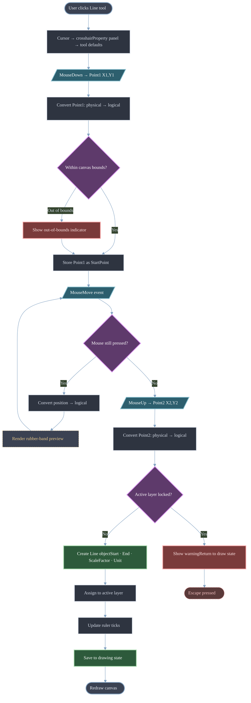
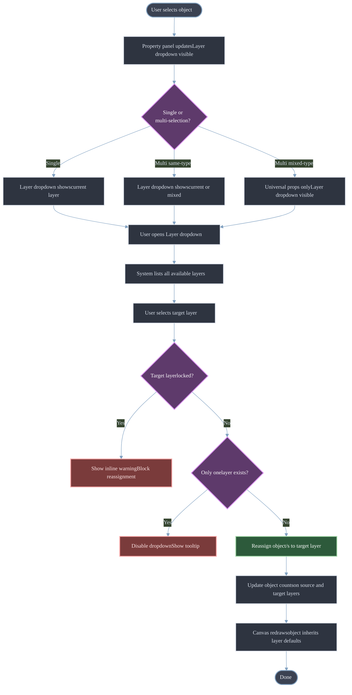
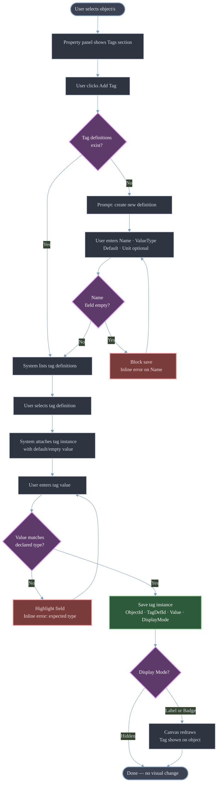
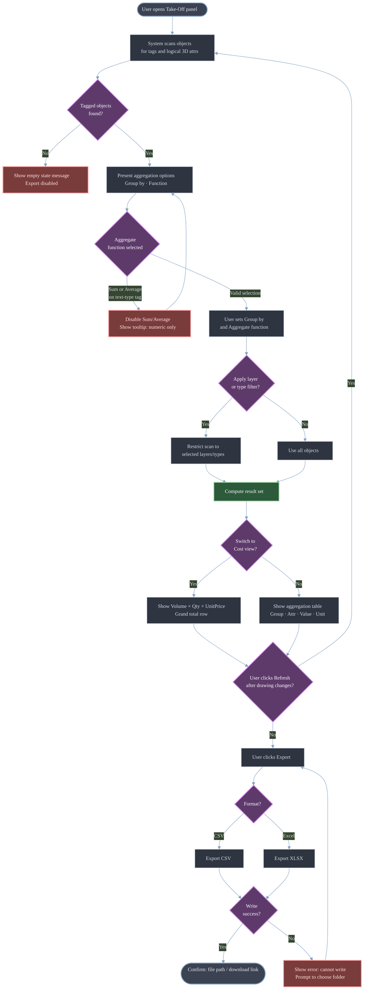
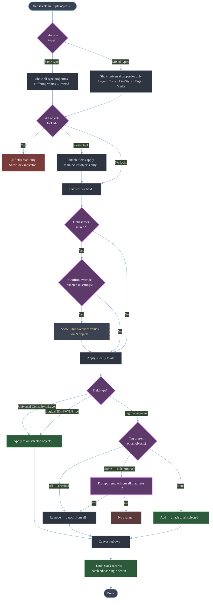
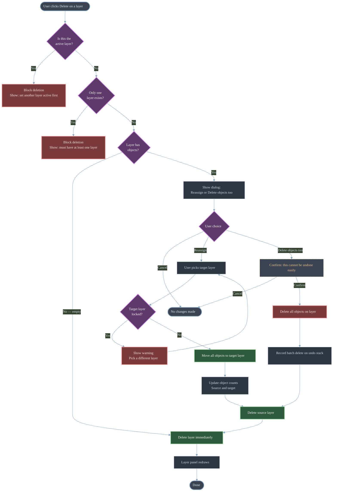
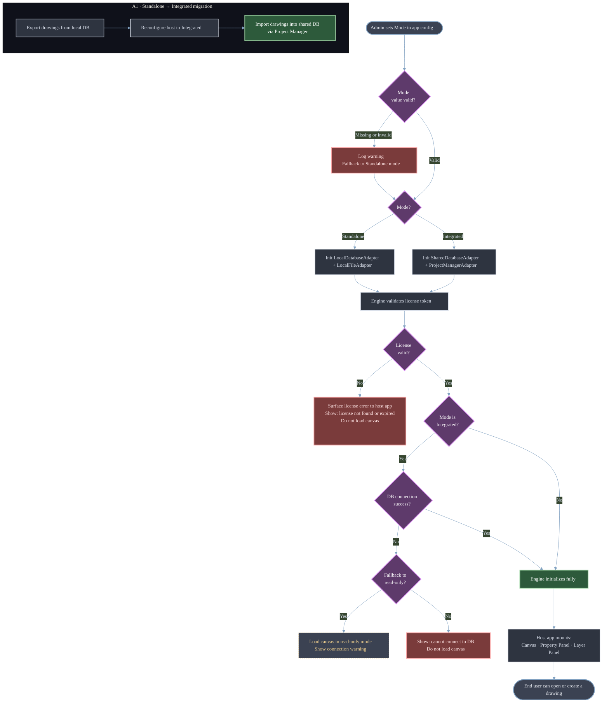
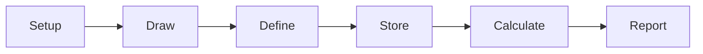

```mermaid
%%{init: {
  'theme': 'base',
  'themeVariables': {
	'background': '#1A1B26',
	'primaryColor': '#2F3545',
	'primaryTextColor': '#D9E0EE',
	'primaryBorderColor': '#414868',
	'lineColor': '#81A1C1',
	'tertiaryColor': '#0F111A',
	'fontSize': '14px',
	'fontFamily': 'Inter, -apple-system, sans-serif'
  },
  'flowchart': {
	'curve': 'basis',
	'padding': 15
  }
}}%%
flowchart TD
classDef terminator fill:#3B4252,stroke:#81A1C1,stroke-width:2px,color:#ECEFF4
classDef process fill:#2E3440,stroke:#D8DEE9,stroke-width:1.5px,color:#D8DEE9
classDef decision fill:#5E3A6B,stroke:#D68BEE,stroke-width:2px,color:#FFFFFF
classDef io fill:#2D5F6E,stroke:#88C0D0,stroke-width:2px,color:#FFFFFF
classDef error fill:#7A3B3B,stroke:#F8A3A3,stroke-width:2px,color:#FFE6E6
classDef preview fill:#3B4252,stroke:#EBCB8B,stroke-dasharray:3,color:#EBCB8B
classDef success fill:#2D5A3B,stroke:#A3D8A8,stroke-width:2px,color:#FFFFFF
classDef cancel fill:#5A3A3A,stroke:#C17E7E,stroke-dasharray:4,color:#F5C2C2


	A([User opens Symbol Library panel]):::terminator
	B{Library<br/>empty?}:::decision
	B1[Show empty state<br/>Prompt: import or create]:::error
	C[System lists symbols by category]:::process
	D{User action}:::decision
	E[User locates symbol]:::process
	F[User selects symbol file]:::io
	G{Valid<br/>format?}:::decision
	G1[Show import error]:::error
	H[Add to project library]:::success
	I[User drags to canvas<br/>or double-clicks to insert]:::process
	J{Set scale/rotation<br/>before placing?}:::decision
	K[User sets Scale X·Y · Rotation<br/>in property panel]:::process
	L[Use defaults: Scale 1,1 · Rotation 0°]:::process
	M[System enters insert mode<br/>Ghost preview on cursor]:::preview
	N{Active layer<br/>locked?}:::decision
	N1[Show warning<br/>Block placement]:::error
	O[User clicks placement point]:::io
	P[Check circular block reference]:::process
	P1[Block · Show error:<br/>cannot contain itself]:::error
	Q[Place symbol instance<br/>at clicked position]:::success
	R[Assign to active layer<br/>Save to drawing state]:::process
	S{Place another<br/>instance?}:::decision
	T[Press Escape to exit insert mode]:::cancel
	U([Canvas redraws]):::terminator
	
	A --> B
	B -->|Yes| B1
	B1 --> C
	B -->|No| C
	C --> D
	D -->|Browse/Search| E
	D -->|Import from file| F
	F --> G
	G -->|No| G1
	G1 --> D
	G -->|Yes| H
	H --> E
	E --> I
	I --> J
	J -->|Yes| K
	J -->|No| L
	K & L --> M
	M --> N
	N -->|Yes| N1
	N -->|No| O
	O --> P
	P -->|Detected| P1
	P -->|Clear| Q
	Q --> R
	R --> S
	S -->|Yes| M
	S -->|No| T
	T --> U
```

# SDLC Document Library

---

# 00 — Governance

## 0001 — SDLC Governance
	
- **Purpose**
	Define document standards, lifecycle, and ownership across the SDLC.
- **Standards**
	- Lifecycle: Draft → In Review → Approved → Deprecated
	- Versioning: MAJOR.MINOR.PATCH (e.g., 1.0.0)
	- Review cadence: Quarterly or on major change
- **Required Metadata**
	- Phase
	- Owner
	- Status
	- Version
	- Last updated
	- Reviewers
	
---

# 01 — Inception

## 🧠 0101 — Requirement Analysis

---

### 🎯 Purpose 

Define the **business vision, product scope, users, and success criteria** for the CoNSoL platform and its flagship application, **CoNSoL‑TakeOff**.

- **This document answers:**
	
	- What problem are we solving?
	- What is CoNSoL?
	- What is CoNSoL‑TakeOff?
	- Who is this for?
	- What is in scope vs out of scope?
	
---

### 🏗️ 1. What is CoNSoL? 

**CoNSoL (Construction Solution)** is a **modular construction management platform** designed around a hub‑and‑spoke architecture.

#### Platform Characteristics
	
- **Core Engine:** CoNSoL‑Engine
	- Orchestration
	- Shared services
	- Licensing
	- Inter‑module communication
- **Mandatory Module:** CoNSoL‑Project Manager
	- Projects
	- Timelines
	- Dependencies
	- Resource allocation
- **Optional Modules:**
	- CoNSoL‑TakeOff
	- CoNSoL‑HR
	- CoNSoL‑Docs
	- Others (future)
	
#### Architectural Principle

> **Some modules can run standalone, others require the Core Engine.**

---

### 🧱 2. What is CoNSoL‑TakeOff?

**CoNSoL‑TakeOff** is a **visual-first construction take‑off and estimation tool**.

#### Core Idea

> ✏️ **Drawing is not decoration. Drawing is data input.**

Users **draw construction elements visually**, and those drawings are treated as:
- Data objects
- With geometry
- With business meaning
- With calculable quantities and costs

---

#### Key Capabilities
	
- **Draw physical elements** (walls, slabs, rooms, columns)
- **Assign real‑world meaning to shapes**
- **Link shapes to:**
	- Materials
	- Formulas
	- Prices
- **Automatically compute**:
	- Quantities
	- Costs
	- Material breakdowns
	
---

#### Deployment Modes

| **Mode**   | **Description**                                     |
| ---------- | --------------------------------------------------- |
| Standalone | Desktop app, local DB, standalone license           |
| Integrated | Embedded in CoNSoL‑Engine, shared DB, suite license |

---

### ❗ 3. Problem Statement

#### Current Pain Points
	
- Manual spreadsheets are error‑prone
- CAD tools are disconnected from estimation
- Quantity take‑off is slow and inconsistent
- Changes require rework across tools
	
---

#### Why Existing Tools Fail

| **Tool Type**       | **Limitation**          |
| ------------------- | ----------------------- |
| Excel               | No visual context       |
| CAD                 | No business logic       |
| Estimation software | No direct drawing input |

---

### ✅ 4. Proposed Solution 

**CoNSoL‑TakeOff provides:**
	
- ✅ Visual drawing interface
- ✅ Metadata‑driven objects
- ✅ Real‑time quantity calculation
- ✅ Database‑backed materials and formulas
- ✅ Automatic cost rollups
	
---

### 👥 5. Target Users

#### Primary Users
	
- Construction estimators
- Site engineers
- Quantity surveyors
	
#### Secondary Users
	
- Architects / designers
- Procurement teams
- Project managers
	
---

### 🔄 6. High-Level User Workflow 

```text
Setup → Draw → Define → Store → Calculate → Report
```

***Where:***
	
- **Draw** = visual geometry
- **Define** = business meaning
- **Calculate** = quantities & cost

---

### 🧩 7. Core Concepts

#### 7.1 Dimension Modes

| **Mode** | **Meaning** |
| -------- | ----------- |
| D0       | Count       |
| D1       | Length      |
| D2       | Area        |
| D3       | Volume      |

Each drawn object uses **exactly one dimension mode**.

---

#### 7.2 Nested Objects
	
- Doors inside walls
- Openings inside slabs
- Windows subtract from wall area
	
---

### 📦 8. Scope

#### ✅ In Scope (v1 / Demo)
	
- 2D drawing canvas
- Logical 3D attributes (H × W × L)
- Materials & formulas
- Cost estimation
- Standalone deployment
	
---

#### ❌ Out of Scope (v1)
	
- True 3D rendering
- Real‑time collaboration
- Cloud sync
- AI‑assisted drawing (future)
	
---

### 📊 9. Success Criteria 

#### Demo Success
	
- User can draw a wall in < 5 minutes
- System shows automatic quantity
- Cost estimate is generated
- Exportable summary exists
	
---

#### Product Success
	
- Reduction in estimation time
- Fewer quantity errors
- Faster design iteration

---

### ⚠️ 10. Assumptions & Constraints

#### Assumptions
	
- Users are familiar with construction concepts
- Desktop-first usage
- Single-user for demo phase

#### Constraints
	
- Windows platform initially
- .NET ecosystem
- Offline-first in standalone mode

---

### 🔗 Related Documents

- [[CoNSoL-Documents-Library-V2/MegaFile/01-Inception/0102-Planning|0102-Planning]]
- [[CoNSoL-Documents-Library-V2/MegaFile/02-Design/020101-System Context|0201-Design_Documentation]]
- [[CoNSoL-Documents-Library-V2/MegaFile/02-Design/0208-UX_UI Design|0208-UX_UI_Design]]
- [[CoNSoL-Documents-Library-V2/MegaFile/01-Inception/0104-SRS|0104-SRS]] 

---
> END — Requirement Analysis
---


---
## 🗓️ 0102 — Planning


**Type:** 📋 Living plan  
**Filled by:** Project Manager

✅ Standard structure (tables only):
### Roadmap 

| **Phase** | **Scope** | **Owner** | **Target** |
| --------- | --------- | --------- | ---------- |
|           |           |           |            |

### Risks 

| **Risk** | **Probability** | **Impact** | **Mitigation** |
| -------- | --------------- | ---------- | -------------- |
|          |                 |            |                |

---
> END — Planning
---

## 🔗 0103 — Requirements Traceability

**Type:** 📋 Register  
**Filled by:** QA / PM

| **Req ID** | **Source** | **Design** | **Code** | **Test** |
| ---------- | ---------- | ---------- | -------- | -------- |
|            |            |            |          |          |

**Phase:** Inception  
**Owner:** Product + QA  
**Status:** Draft  

### Purpose
Ensure full traceability from requirements to delivery.

### Templates
- Requirements Traceability Matrix (RTM)  
- Requirement ID conventions  

---


## 📘 0104 — Software Requirements Specification (SRS)

### CoNSoL‑TakeOff Drawing Engine

---
### Document Control

| **Field**   | **Value**                           |
| ----------- | ----------------------------------- |
| Document ID | SRS-SCAD-001                        |
| Product     | CoNSoL‑TakeOff                      |
| Scope       | Drawing Engine (Reusable Component) |
| Status      | Draft                               |

---

### 1. Introduction

#### 1.1 Purpose

This document defines the **software requirements** for the **CoNSoL‑TakeOff Drawing Engine**, a reusable 2D drawing and take‑off component intended for desktop and web host applications.

It serves as:
- A contract between product and engineering
- A reference for QA and validation
- A baseline for future enhancements

---

#### 1.2 Scope

- **The Drawing Engine provides:**
	
	- A 2D visual canvas
	- Logical 3D attributes (H × W × L)
	- Drawing tools (shapes, curves, text, dimensions, symbols)
	- Context‑sensitive panels
	- Layer management
	- Smart Tags and Custom Marks
	- Quantity & pricing aggregation

#### Out of Scope (v1)

- True 3D rendering
- Real‑time collaboration
- Cloud synchronization

---

#### 1.3 Definitions & Acronyms

| **Term**             | **Definition**                           |
| -------------------- | ---------------------------------------- |
| Logical Coordinates  | Unit-aware coordinate system             |
| Physical Coordinates | Screen pixels                            |
| Smart Tag            | Data metadata attached to objects        |
| Custom Mark          | Visual marker attached to objects        |
| Take‑off             | Quantity & cost extraction from drawings |

---

### 2. Overall Description

#### 2.1 Product Perspective

The Drawing Engine is a **library**, not a standalone app.

It is consumed by:
- CoNSoL‑TakeOff (standalone)
- CoNSoL‑Suite (integrated)

---

#### 2.2 Operating Environment

- Desktop: Windows (WPF / WinForms)
- Web: Blazor / HTML5 Canvas (future)
- .NET ecosystem

---

#### 2.3 Design Constraints

- Core engine must be UI‑framework‑agnostic
- Logical and physical coordinates must be separated
- Validation logic must be split:
  - Data‑level (engine)
  - UI‑level (presentation)

---

### 3. Stakeholders & User Classes

| **User**           | **Description**                |
| ------------------ | ------------------------------ |
| Designer           | Creates and edits drawings     |
| Estimator          | Reviews quantities and costs   |
| Host App Developer | Integrates engine              |
| Admin              | Manages deployment & licensing |

---

### 4. System Context & Deployment

#### 4.1 Deployment Modes

| Mode | Description |
|----|----|
| Standalone | Local DB, local files |
| Integrated | Shared DB, suite services |

---

### 5. Functional Requirements

#### 5.1 Drawing Tools

#### Basic Shapes

| **ID**    | **Requirement**                                          |
| --------- | -------------------------------------------------------- |
| FR‑DT‑001 | The system shall allow drawing a Line by start/end click |
| FR‑DT‑002 | The system shall support multi‑segment polylines         |
| FR‑DT‑003 | The system shall support Rectangle drawing               |
| FR‑DT‑004 | The system shall support Circle drawing                  |
| FR‑DT‑005 | The system shall support Ellipse drawing                 |

---

#### Curves

| **ID**    | **Requirement**                         |
| --------- | --------------------------------------- |
| FR‑DT‑010 | The system shall support Arc drawing    |
| FR‑DT‑011 | The system shall support Spline drawing |
| FR‑DT‑012 | The system shall support Bezier curves  |

---

#### Annotations & Dimensions

| **ID**    | **Requirement**                                        |
| --------- | ------------------------------------------------------ |
| FR‑DT‑020 | The system shall support Text                          |
| FR‑DT‑021 | The system shall support Multiline Text                |
| FR‑DT‑022 | The system shall support Leaders                       |
| FR‑DT‑023 | The system shall support all standard dimension types  |
| FR‑DT‑025 | The system shall allow dimension override with warning |

---

#### Symbols & Blocks

| **ID**    | **Requirement**                                      |
| --------- | ---------------------------------------------------- |
| FR‑DT‑030 | The system shall support a Symbol Library            |
| FR‑DT‑031 | Symbols shall be insertable via drag or double‑click |
| FR‑DT‑033 | Circular block references shall be blocked           |

---

#### Smart Tags

| **ID**    | **Requirement**                        |
| --------- | -------------------------------------- |
| FR‑DT‑040 | Users shall define Smart Tags          |
| FR‑DT‑041 | Smart Tags shall attach to any object  |
| FR‑DT‑043 | Tags shall support aggregation         |
| FR‑DT‑045 | Aggregation output shall be exportable |

---

#### Custom Marks

| **ID**    | **Requirement**                      |
| --------- | ------------------------------------ |
| FR‑DT‑050 | Users shall define Custom Marks      |
| FR‑DT‑051 | Marks shall be attachable to objects |
| FR‑DT‑052 | Marks shall be countable             |

---

#### 5.2 Canvas & Coordinate System

| **ID**    | **Requirement**                             |
| --------- | ------------------------------------------- |
| FR‑CV‑001 | Canvas shall operate in logical coordinates |
| FR‑CV‑004 | Pan & zoom shall not alter logical data     |
| FR‑CV‑007 | Rubber‑band preview required                |

---

#### 5.3 Property Panel

| **ID**    | **Requirement**                                 |
| --------- | ----------------------------------------------- |
| FR‑PP‑001 | Property panel shall be context‑sensitive       |
| FR‑PP‑004 | Mixed values shall show `(mixed)`               |
| FR‑PP‑008 | Logical 3D fields shall appear where applicable |

---

#### 5.4 Layer Panel

| **ID**    | **Requirement**                                         |
| --------- | ------------------------------------------------------- |
| FR‑LP‑001 | Layers shall support visibility, lock, print            |
| FR‑LP‑003 | Deleting a layer with objects shall prompt reassignment |
| FR‑LP‑004 | Active layer deletion shall be blocked                  |

---

### 6. UI & Interaction Requirements

#### 6.1 General UI

- Light & dark mode
- Responsive panels
- Inline validation feedback

---

#### 6.2 Tool Interaction Model

- MouseDown → start
- MouseMove → preview
- MouseUp → commit
- Escape → cancel

---

#### 6.3 Validation Rules

- Zero‑size shapes blocked
- Invalid input highlighted inline
- Non‑blocking warnings preferred

---

#### 6.4 Multi‑Selection Behavior

- Shared fields editable
- Type‑specific fields hidden
- `(mixed)` replaces differing values

---

### 7. Non‑Functional Requirements

| **ID**  | **Category**  | **Requirement**  |
| ------- | ------------- | ---------------- |
| NFR‑001 | Performance   | < 16ms redraw    |
| NFR‑004 | Portability   | UI‑agnostic core |
| NFR‑006 | Serialization | Lossless JSON    |

---

### 8. Component Architecture

```text
Engine (UI‑free)
├── Drawing Objects
├── Coordinate Service
├── Layer Service
├── Tag & Mark Service
├── Take‑Off Service (optional)
└── Serialization
```

---

### 9. Data Model (Overview)

(See [[CoNSoL-Documents-Library-V2/MegaFile/02-Design/020103-Data Model|020103-Data_Model]] for full definition)

---

### 10. Use Cases

#### UC‑001 — Draw a Line on the Canvas

| **Field**    | **Value**                                                         |
| ------------ | ----------------------------------------------------------------- |
| Actor        | Designer                                                          |
| Related FR   | FR-DT-001, FR-DT-002, FR-CV-007, FR-CV-008, FR-UI-011, FR-UI-013  |
| Precondition | A drawing is open; at least one layer exists and is set as active |
| Trigger      | User clicks the Line tool in the toolbox                          |
##### Flowchart



##### Main Flow
1. User clicks the **`Line`** tool
2. System sets cursor to _`crosshair`_; property panel switches to tool defaults
3. User clicks **`Point1`** on the canvas
4. System converts Point1 from physical (`px`) to ****`logical coordinates`***
5. System validates **`Point1`** is within canvas bounds
6. System stores **`Point1`** as `StartPoint`
7. User moves the mouse — system renders a **`rubber-band preview`** line from `StartPoint` to current cursor position on every `MouseMove` event
8. User clicks **`Point2`**
9. System converts **`Point2`** to logical coordinates
10. System creates a **`Line`** object `{ StartPoint, EndPoint, ScaleFactor, Unit }`
11. System assigns the line to the **`active layer`**
12. System updates **`ruler ticks`** to reflect the new ___`geometry`___
13. System saves the line to drawing state (`JSON` / `DB`)
14. Canvas redraws showing the permanent line

##### Alternative Flows
###### **`A1` — Multi-segment polyline mode**
- After step 6, user continues clicking additional points
- System stores each click as a new segment endpoint and extends the rubber-band from the last point
- User double-clicks or presses **Enter** to commit all segments as a single polyline object
- Flow continues from step 10

###### **`A2` — Snap to grid / object snap active**
- At step 3 or step 8, cursor snaps to the nearest grid intersection or object snap point
- Snapped coordinate is used in place of the raw cursor position
- Flow continues normally

###### **`A3` — Point outside canvas bounds (warn, don't block)**
- At step 5, system detects Point1 is outside logical canvas bounds
- System shows an out-of-bounds indicator but does not block the action
- Flow continues from step 6 with the out-of-bounds coordinate

##### Exception Flows
###### **`E1` — User presses Escape during drawing**
- At any point after step 3 and before step 10
- System cancels the operation, discards Start-Point, clears the rubber-band preview
- System returns cursor to idle state; no object is created

###### **`E2` — Active layer is locked**
- At step 11, system detects the active layer is locked
- System shows inline warning: "Active layer is locked — object cannot be placed"
- Object is not saved; system returns to drawing state for the user to select a different layer

##### Postcondition
A Line (or polyline) object exists in the drawing state, is visible on canvas, is assigned to the active layer, and is reflected in the layer's object count.

---

#### UC-002 · Assign an object to a layer 

| **Field**    | **Value**                                                                     |
| ------------ | ----------------------------------------------------------------------------- |
| Actor        | Designer                                                                      |
| Related FR   | FR-LP-001, FR-PP-007, FR-UI-020                                               |
| Precondition | At least one object exists on the canvas; at least two layers exist           |
| Trigger      | User selects an object and changes its layer assignment in the property panel |
##### Flowchart



##### Main Flow
1. User clicks an object on the canvas to select it
2. Property panel updates to show the object's properties, including the **Layer** dropdown
3. User opens the Layer dropdown
4. System lists all available (non-deleted) layers
5. User selects a target layer
6. System reassigns the object to the selected layer
7. System updates the object count on both the source layer and the target layer
8. Canvas redraws — object inherits the target layer's default Color, Line Style, and Line Weight (unless the object has explicit overrides)

##### Alternative Flows
###### **A1 — Multi-selection, same type**
- User selects multiple objects (same type) before step 3
- Layer dropdown shows `(mixed)` if objects are on different layers
- User selects a target layer — system reassigns all selected objects
- All affected layer object counts update

###### **A2 — Multi-selection, mixed types**
- Property panel shows only universal properties including Layer
- Behavior otherwise identical to A1

###### **A3 — Assign via Layer panel ("Select All on Layer" + move)**
- User right-clicks a layer in the Layer panel → "Select All Objects"
- All objects on that layer become selected
- User changes Layer in property panel → all objects move to the new layer

##### Exception Flows
###### **E1 — Target layer is locked**
- At step 6, system detects the target layer is locked
- System shows inline warning: "Target layer is locked"
- Reassignment is blocked; original layer assignment is preserved

###### **E2 — Only one layer exists**
- At step 4, dropdown shows only one layer
- Reassignment is not meaningful; system may disable the dropdown or show a tooltip: "Add more layers to reassign"

##### Postcondition
The selected object(s) belong to the chosen layer. Object counts on affected layers are accurate. Visual properties reflect the new layer's defaults (unless overridden at object level).


---
#### UC-003 · Attach a Smart Tag to an object 

| **Field**    | **Value**                                                                                    |
| ------------ | -------------------------------------------------------------------------------------------- |
| Actor        | Designer                                                                                     |
| Related FR   | FR-DT-040, FR-DT-041, FR-DT-042, VAL-010 (tag value type)                                    |
| Precondition | An object is selected; at least one Smart Tag definition exists (or user creates one inline) |
| Trigger      | User opens the Tags section in the property panel and adds a tag                             |
##### Flowchart




##### Main Flow
1. User selects an object on the canvas
2. Property panel shows the **Tags** section (collapsed by default if no tags are attached)
3. User clicks **Add Tag**
4. System presents the list of existing tag definitions
5. User selects a tag definition (e.g. `Material: text`)
6. System attaches a tag instance to the object with an empty or default value
7. User enters/selects the tag value (e.g. `"Concrete"`)
8. System validates the value against the tag's declared value type
9. System saves the tag instance: `{ ObjectId, TagDefinitionId, Value, DisplayMode }`
10. If Display Mode is **Label** or **Badge**, the canvas redraws showing the tag on the object

##### Alternative Flows
###### **A1 — Create a new tag definition inline**
- At step 4, user clicks **New Tag Definition**
- User enters: Name, Value Type (text / number / boolean / list), Default Value, Unit (optional)
- System saves the definition to the project's tag library
- Flow continues from step 5 with the new definition pre-selected

###### **A2 — Attach the same tag to multiple objects**
- User selects multiple objects before step 3
- Tags section shows the union of tags; tags present on all objects = checked; tags on some = indeterminate
- User adds a tag → system attaches it to all selected objects
- Each object gets its own tag instance (values can be set individually afterward)

###### **A3 — Change display mode**
- After step 9, user changes Display Mode from Hidden → Label or Badge
- Canvas redraws showing the tag label/badge on the object

##### Exception Flows
###### **E1 — Value type mismatch**
- At step 8, user enters a non-numeric value for a Number-type tag
- System highlights the value field with an inline error: "Expected a numeric value"
- Tag instance is not saved until the value is corrected

###### **E2 — Tag definition has no name**
- At A1, user attempts to save a definition with an empty Name field
- System blocks save; inline error on the Name field

##### Postcondition
The tag instance is attached to the object, stored in drawing state, and visible on canvas if Display Mode is Label or Badge.

---

#### UC-004 · Run a take-off quantity summary

| **Field**    | **Value**                                                                                              |
| ------------ | ------------------------------------------------------------------------------------------------------ |
| Actor        | Estimator                                                                                              |
| Related FR   | FR-DT-043, FR-DT-044, FR-DT-045, FR-PP-008                                                             |
| Precondition | At least one object has logical 3D attributes (H, W, L) and/or Smart Tags with numeric values assigned |
| Trigger      | User opens the Aggregation / Take-Off panel                                                            |
##### Flowchart



##### Main Flow
1. User opens the **Take-Off panel** (standalone view or docked panel)
2. System scans all objects in the current drawing that have tag instances or logical 3D attributes
3. System presents aggregation options:
	- **Group by**: Tag Name / Layer / Object Type
	- **Aggregate function**: Count / Sum / Average / Min / Max
4. User selects grouping and aggregate function
5. System computes the result set and displays it as a table:
	- Columns: Group, Tag/Attribute, Aggregated Value, Unit
	- Rows: one per group
6. User reviews the table
7. User clicks **Export**
8. System exports the table to CSV or Excel (user selects format)
9. System confirms export success with file path / download link

##### Alternative Flows

###### **A1 — Filter by layer before aggregating**
- Before step 4, user selects one or more layers to include
- System restricts the scan to objects on those layers only
- Flow continues from step 4

###### **A2 — Filter by object type**
- User adds an Object Type filter (e.g. only Rectangles)
- System restricts aggregation to matching objects
- Useful for: "total area of all room rectangles"

###### **A3 — Cost rollup view**
- User switches to **Cost view**
- System shows: Volume (H×W×L) × Quantity × Unit Price = Total Cost per object
- Summary row shows grand total cost
- Exportable in same formats

###### **A4 — Re-run after drawing changes**
- User modifies objects (adds/edits dimensions or tags) then returns to the Take-Off panel
- User clicks **Refresh**
- System re-scans and updates the result table

##### Exception Flows
###### **E1 — No tagged objects found**
- At step 2, system finds no objects with relevant attributes
- System shows empty state message: "No objects with tags or dimensions found. Assign Smart Tags or logical dimensions to objects first."
- Export is disabled

###### **E2 — Sum/Average on a text-type tag**
- At step 4, user selects Sum or Average for a text-type tag
- System disables those functions for that tag; only Count is available
- Inline tooltip: "Sum and Average are only available for numeric tags"

###### **E3 — Export path not writable (desktop mode)**
- At step 8, system cannot write to the selected path
- System shows error: "Cannot write to this location. Choose a different folder."
- Export is retried without losing the result table

##### Postcondition
A take-off summary table is computed and optionally exported. No drawing objects are modified by this operation.

---


---

#### UC-005 · Insert a symbol from the library

| **Field**    | **Value**                                                                                 |
| ------------ | ----------------------------------------------------------------------------------------- |
| Actor        | Designer                                                                                  |
| Related FR   | FR-DT-030, FR-DT-031, FR-DT-032, FR-DT-033                                                |
| Precondition | A drawing is open; at least one symbol definition exists in the project or global library |
| Trigger      | User opens the Symbol Library panel                                                       |
##### Flowchart




##### Main Flow
1. User opens the **Symbol Library** panel
2. System lists available symbols grouped by category
3. User browses or searches for a symbol
4. User drags the symbol onto the canvas (or double-clicks to activate insert mode)
5. System enters **insert mode**: cursor shows a ghost preview of the symbol
6. User positions the cursor at the desired insertion point and clicks
7. System places a symbol instance at the clicked position with default Scale (1,1) and Rotation (0°)
8. System assigns the instance to the active layer
9. System saves the symbol instance to drawing state
10. Canvas redraws showing the placed symbol

##### Alternative Flows

###### **A1 — Set scale / rotation before placing**
- After step 4 and before step 6, user sets Scale X, Scale Y, and Rotation in the property panel (tool defaults mode)
- Placed instance uses the specified values

###### **A2 — Place multiple instances**
- After step 7, system remains in insert mode
- User continues clicking to place additional instances of the same symbol
- User presses Escape to exit insert mode

###### **A3 — Edit attribute values after placement**
- After step 10, user selects the placed instance
- Property panel shows editable **Attribute Values** (key-value pairs defined in the block definition)
- User edits values; system saves to the instance (block definition is not modified)

###### **A4 — Import a symbol from file**
- In the Symbol Library panel, user clicks **Import**
- User selects a symbol file (format TBD — JSON / DXF block)
- System validates and adds the definition to the project library
- Flow continues from step 3

##### Exception Flows
###### **E1 — Circular block reference detected**
- User attempts to define a symbol that contains itself (directly or transitively)
- System blocks the definition save with error: "Circular reference detected — a symbol cannot contain itself"

###### **E2 — Active layer is locked**
- At step 8, system detects the active layer is locked
- System shows warning and blocks placement
- User must unlock the layer or switch to a different active layer

###### **E3 — Symbol library is empty**
- At step 2, no symbols exist
- System shows empty state with a prompt to import or create a symbol

##### Postcondition
A symbol instance exists on the canvas, assigned to the active layer, with the correct position, scale, rotation, and attribute values.

---

#### UC-006 · Edit properties of a multi-selection 

| **Field**    | **Value**                                                                     |
| ------------ | ----------------------------------------------------------------------------- |
| Actor        | Designer                                                                      |
| Related FR   | FR-UI-020, FR-UI-021, FR-UI-022, FR-UI-023, FR-PP-004, FR-PP-005              |
| Precondition | At least two objects exist on the canvas                                      |
| Trigger      | User selects multiple objects (window select, crossing select, or Ctrl+click) |

##### Flowchart


##### Main Flow
1. User selects multiple objects
2. System identifies the selection: same type or mixed types
3. **If same type:** property panel shows all properties for that type; fields with differing values show `(mixed)`
4. **If mixed types:** property panel shows only universal properties (Layer, Color, Line Style, Line Weight, Visibility, Lock, Notes, Tags, Marks)
5. User edits a shared field (e.g. Color)
6. System applies the new value to **all selected objects**
7. Canvas redraws reflecting the change across all affected objects

##### Alternative Flows

###### **A1 — Edit a `(mixed)` field**
- User clicks a field showing `(mixed)` and enters a new value
- System replaces the differing values on all selected objects with the single new value
- A confirmation may be shown: "This will override different values on N objects" (configurable)

###### **A2 — Edit logical 3D fields in multi-selection**
- Fields H, W, L, Quantity, Unit Price follow the same `(mixed)` pattern
- Editing sets the same value on all selected objects

###### **A3 — Tag management in multi-selection**
- Tags present on **all** selected objects show as checked
- Tags present on **some** objects show as indeterminate (tri-state checkbox)
- Adding a tag → attached to all selected objects
- Removing a checked tag → removed from all selected objects
- Removing an indeterminate tag → prompts: "Remove from all objects that have it?"

###### **A4 — Type-specific fields in same-type multi-selection**
- e.g. Two lines selected: Start/End coordinates show `(mixed)`; editing sets the same value on both
- This is an edge case the user would rarely want — system applies without blocking

##### Exception Flows

###### **E1 — All selected objects are locked**
- System shows all fields as read-only with a lock indicator
- No edits are possible until at least one object is unlocked

###### **E2 — Partial lock in selection**
- Some selected objects are locked, some are not
- System applies edits only to unlocked objects
- Inline notice: "N locked objects were skipped"

##### Postcondition
All unlocked selected objects reflect the edited property values. The canvas redraws. Undo stack records the batch edit as a single undoable action.


---

#### UC-007 · Delete a layer with objects

| **Field**    | **Value**                                                                |
| ------------ | ------------------------------------------------------------------------ |
| Actor        | Designer                                                                 |
| Related FR   | FR-LP-003, FR-LP-004                                                     |
| Precondition | At least two layers exist; the target layer contains one or more objects |
| Trigger      | User clicks Delete on a layer in the Layer panel                         |

##### Flowchart


##### Main Flow
1. User clicks **Delete** on a layer that contains objects
2. System detects the layer has objects (object count > 0)
3. System presents a dialog with two options:
	- **Reassign objects to layer:** `[layer dropdown]`
	- **Delete objects too**
4. User selects **Reassign** and picks a target layer
5. System moves all objects from the deleted layer to the target layer
6. System updates object counts on both layers
7. System deletes the source layer
8. Layer panel redraws without the deleted layer

##### Alternative Flows
###### **A1 — User chooses "Delete objects too"**
- At step 3, user selects **Delete objects too** and confirms
- System removes all objects on the layer from the drawing state
- System deletes the layer
- Objects are removed from canvas; undo stack records the batch delete as a single undoable action

###### **A2 — Layer has no objects (object count = 0)**
- At step 2, system detects the layer is empty
- System skips the dialog and deletes the layer immediately
- Flow jumps to step 7

###### **A3 — Delete via keyboard shortcut or context menu**
- Same flow triggered from a different entry point; behavior is identical

##### Exception Flows

###### **E1 — Target layer is the active layer**
- At step 1, user attempts to delete the currently active layer
- System blocks deletion with inline message: "Cannot delete the active layer. Set another layer as active first."
- No dialog is shown; no changes are made

###### **E2 — Only one layer remains**
- System blocks deletion with inline message: "A drawing must have at least one layer."

###### **E3 — User cancels the dialog**
- At step 3, user clicks Cancel
- No changes are made; layer and all its objects remain intact

##### Postcondition
The target layer no longer exists in the layer list. All objects that were on it are either reassigned to another layer (with correct object counts) or deleted from drawing state. The canvas reflects the final state.

---

#### UC-008 · Switch between standalone and integrated mode

| **Field**    | **Value**                                                                                  |
| ------------ | ------------------------------------------------------------------------------------------ |
| Actor        | System Admin / IT                                                                          |
| Related FR   | NFR-008 (licensing), Component Architecture §8                                             |
| Precondition | The CoNSoL-TakeOff Engine library is installed; a valid license exists for the target mode |
| Trigger      | Admin deploys or reconfigures the host application                                         |

> [!Note]+ ***Note***
> This is a **deployment-time** use case, not an end-user runtime action. The mode is set by the host application at startup via configuration — the user does not switch modes mid-session.
##### Flowchart



##### Main Flow
1. Admin sets the deployment mode in the host application's configuration (e.g. `app.config`, environment variable, or installer option):
	- `Mode = Standalone` or `Mode = Integrated`
2. Host application initializes the CoNSoL-TakeOff Engine with the appropriate storage adapter:
	- **Standalone:** `LocalDatabaseAdapter` + `LocalFileAdapter`
	- **Integrated:** `SharedDatabaseAdapter` + `ProjectManagerAdapter`
3. Engine validates the license token for the selected mode
4. License is valid → Engine initializes fully; host application proceeds to load the drawing UI
5. Host application connects the drawing canvas, property panel, and layer panel components
6. End user can now open or create a drawing

##### Alternative Flows
###### **A1 — Migrating from Standalone to Integrated**
- Admin exports existing drawings from the standalone local database (using File → Export)
- Admin reconfigures the host to Integrated mode
- Admin imports drawings into the shared database via the Project Manager
- Drawings are now accessible to other suite users

##### Exception Flows
###### **E1 — License validation fails**
- At step 3, Engine cannot validate the license token
- Engine surfaces a license error to the host application
- Host application shows appropriate message to the end user (e.g. "License not found or expired")
- Drawing canvas does not load

###### **E2 — Storage adapter connection fails (Integrated mode)**
- At step 2, the `SharedDatabaseAdapter` cannot connect to the shared database
- Engine surfaces a connection error
- Host application shows: "Cannot connect to shared database. Check network or database configuration."
- Application may optionally fall back to read-only mode

###### **E3 — Configuration value is missing or invalid**
- At step 1, Mode is not set or has an unrecognized value
- Host application falls back to `Standalone` as the default safe mode
- Warning is logged

##### Postcondition
The CoNSoL-TakeOff Engine is running in the correct mode with the appropriate storage adapter, license model, and integration points active. End users interact with the same drawing UI regardless of mode.

---

✅ All use cases preserved and indexed

---

### 11. Constraints & Assumptions

- Desktop‑first
- Single‑user initially
- No real‑time collaboration

---
### 12. Appendix

#### Open Questions

- Logical 3D auto‑feed vs manual?
- Shared engine for tags & marks?
- Symbol library format?

---
> END — Software Requirements Specification
---


# 02 — Design

## 📐 0201 — Design Documentation

---

### 🎯 Purpose

Define the system architecture, design decisions, and technical structure for the CoNSoL platform and CoNSoL-TakeOff application.

This document acts as the **single source of truth** for:
- System structure
- Component responsibilities
- Data flow
- Integration boundaries

---

#### 📥 Inputs

- [[CoNSoL-Documents-Library-V2/MegaFile/01-Inception/0101-Requirement_Analysis|0101-Requirement_Analysis]]
- [[CoNSoL-Documents-Library-V2/MegaFile/01-Inception/0102-Planning|0102-Planning]]
- Business workflows
- Product vision

---

#### 📤 Outputs

- Architecture diagrams
- Component definitions
- Data model
- Integration contracts

---

### 🏛️ 1. System Overview

#### 1.1 Platform Structure

```txt
CoNSoL-Suite
├── Core: CoNSoL-Engine
├── Mandatory: Project Manager
├── Modules:
│   ├── TakeOff
│   ├── HR
│   └── Docs
```

---
#### 1.2 Architectural Style

- Modular (Hub-and-Spoke)
- Layered Architecture
- Plugin/Extensible system
- Metadata-driven design

---

#### 1.3 Deployment Modes

#### ✅ Standalone Mode

- Local database (SQLite)
- Single-user
- Offline-first

#### ✅ Integrated Mode

- Shared database
- Connected to CoNSoL-Engine
- Multi-user environment

---

🔗 Related:

- [[CoNSoL-Documents-Library-V2/MegaFile/02-Design/0205-Architecture Decision Records-ADR|0205-Architecture_Decision_Records_ADR]]

---

### 🌍 2. System Context

#### 2.1 Actors

- End User (Engineer, Estimator)
- Admin (Licensing & Deployment)
- External Systems (Future APIs)

---

#### 2.2 External Dependencies

- Database systems (SQLite / SQL Server)
- OS rendering APIs
- File system

---

#### 2.3 Trust Boundaries

- Local execution vs shared environment
- File-based vs DB-based storage

---

### 🧩 3. Core Architecture Components

#### 3.1 High-Level Layers

```txt
Presentation Layer
↓
Application Layer
↓
Domain (Business Logic)
↓
Data Access Layer
↓
```

---

#### 3.2 Component Breakdown

##### 🎨 UI Layer

- Canvas (drawing surface)
- Property Panel
- Layer Panel
- Toolbars

---

##### 🧠 Application Layer

- Orchestration logic
- Workflow handling
- User interaction management

---

##### ⚙️ Domain Layer (Core Engine)

- Drawing Engine
- Calculation Engine
- Tag Engine
- Mark Engine
- Layer Service

---

##### 💾 Data Layer

- JSON serialization
- Database access (Repository pattern)

---

🔗 Related:

- [[0301-Development_Documentation]]

---

### 🧱 4. Drawing Engine Architecture

#### 4.1 Core Abstractions

##### Shape Model

- Geometry (visual)
- Business metadata (logical)

---

##### Shape Hierarchy

```
Shape (Base)
├── Line
├── Rectangle
├── Circle
├── Polyline
├── Text
├── Symbol
```

---
#### 4.2 Interaction Model

- MouseDown → Capture start point
- MouseMove → Render preview (rubber-band)
- MouseUp → Commit object

---

#### 4.3 Coordinate System

- Logical coordinates (units)
- Physical coordinates (pixels)
- ScaleFactor controls mapping

---

### 🔄 5. Workflow Design

#### 5.1 Core User Flow



---

#### 5.2 Definition Stage

- Assign shape → block/material
- Select dimension mode (D0–D3)
- Attach formulas
- Handle nested objects

---

### 🧮 6. Calculation Architecture

#### 6.1 Dimension Modes

| **Mode** | **Description** |
| -------- | --------------- |
| D0       | Count           |
| D1       | Length          |
| D2       | Area            |
| D3       | Volume          |

---

#### 6.2 Calculation Engine Responsibilities

- Compute quantities
- Apply formulas
- Aggregate materials
- Calculate cost

---

#### 6.3 Nested Objects Handling

- Child objects subtract from parent
- Example:
    - Door inside wall → reduces area

---

🔗 Related:

- [[0301-Development_Documentation]]
- [[0401-Testing_Documentation]]

---

### 🗄️ 7. Data Design (High-Level)

#### 7.1 Data Types

- Geometry data → shapes
- Business data → materials, blocks
- Metadata → tags, marks

---

#### 7.2 Storage Strategy

- JSON for canvas state
- Database for persistence
- Hybrid approach

---

🔗 Detailed model:

- [[020103-Data_Model]]

---

### 🔌 8. Integration Design

#### 8.1 Internal Integration

- Engine ↔ UI components
- Calculation ↔ Data model

---

#### 8.2 External Integration (Future)

- REST APIs
- File import/export
- Reporting tools

---

#### 8.3 Plugin Architecture

- Smart Tags extension
- Custom Marks extension
- Symbol libraries

---

### 🌐 9. Deployment Architecture

#### 9.1 Standalone

- Executable application
- Embedded DB
- Local storage

---

#### 9.2 Integrated

- Hosted within CoNSoL Engine
- Shared DB
- Multi-module communication

---

🔗 Related:

- [[0501-Deployment_Documentation]]

---

### 📡 10. Observability Design

#### 10.1 Logging

- User actions
- Errors
- Performance metrics

---

#### 10.2 Monitoring

- Rendering performance
- Calculation time

---

#### 10.3 Alerts (future)

- System failures
- Data corruption

---

### ✅ 11. Quality Attributes

#### 11.1 Performance

- <100ms interaction response
- Smooth rendering with large datasets

---

#### 11.2 Scalability

- Support thousands of shapes
- Efficient memory usage

---

#### 11.3 Reliability

- Autosave mechanism
- Crash recovery

---

#### 11.4 Maintainability

- Layer separation
- Modular components

---

#### 11.5 Security

- Controlled file access
- Safe calculation logic

---

### 🎨 12. UX & Accessibility Considerations

- Grid + snapping
- Keyboard shortcuts
- Dark/light mode
- Accessibility (contrast, scaling)

---

🔗 Related:

- [[Docs/05_CoNSoL-TakeOff-SDLC-Documents-Library/0502-Design/0208-ux_ui_design_en]]

---
### ⚠️ 13. Risks & Considerations

- Complex multi-selection logic
- Performance with large drawings
- Data consistency between JSON and DB
- UI vs engine validation separation

---
### ✅ Design Checklist

- [ ]  Architecture defined
- [ ]  Components identified
- [ ]  Data separation clear
- [ ]  Integration points defined
- [ ]  Deployment model validated

---

### 📌 Notes

- **This document is linked to:**
	- Requirements → [[CoNSoL-Documents-Library-V2/MegaFile/01-Inception/0101-Requirement_Analysis|0101-Requirement_Analysis]]
	- Planning → [[CoNSoL-Documents-Library-V2/MegaFile/01-Inception/0102-Planning|0102-Planning]]
	- Development → [[CoNSoL-Documents-Library-V2/MegaFile/01-Inception/0103-Requirements Traceability|0301-Development_Documentation]]
	- Testing → [[CoNSoL-Documents-Library-V2/MegaFile/04-Verification/0401-Testing Documentation|0401-Testing_Documentation]]

---
> END — Design Documentation
---

## 020101 — System Context

### Checklist
- External systems  
- Actors  
- Trust boundaries  
- Latency expectations  

---

## 020102 — C4 Diagrams

### Checklist
- Context  
- Container  
- Component  
- Code  
- Legend & versioning  

---


## 🗄️ 020103 — Data Model

---

### 🎯 Purpose

Define the logical and physical data structures used by the CoNSoL-TakeOff system, including:

- Drawing data (geometry)
- Business data (materials, formulas)
- Metadata (tags, layers)
- Persistence (JSON + database)

---

#### 📥 Inputs

- [[CoNSoL-Documents-Library-V2/MegaFile/02-Design/0201-Design Documentation|0201-Design_Documentation]]
- [[CoNSoL-Documents-Library-V2/MegaFile/01-Inception/0101-Requirement_Analysis|0101-Requirement_Analysis]]

---

#### 📤 Outputs

- Database schema
- JSON structure
- Data relationships
- Storage strategies

---

### 🧠 1. Data Model Overview

#### 1.1 Design Principles

- ✅ **Separation of Concerns**
	- Geometry vs Business data
- ✅ **Metadata-Driven**
	- Flexible tagging system
- ✅ **Extensible**
	  - Supports plugins (tags, marks, symbols)
- ✅ **Versionable**
	  - JSON-based persistence

---

#### 1.2 Core Data Domains

| **Domain**  | **Description**       |
| ----------- | --------------------- |
| Geometry    | Shapes & spatial data |
| Business    | Materials, formulas   |
| Metadata    | Tags, layers, marks   |
| Persistence | JSON + database       |

---

### 🧱 2. Core Entity Model

#### 2.1 DrawingObject (Base Entity)

```json
{
  "id": "uuid",
  "type": "rectangle",
  "layerId": "layer-001",
  "geometry": {},
  "business": {},
  "tags": [],
  "marks": []
}
```

---

#### 2.2 Geometry Model

```json
"geometry": {
  "type": "rectangle",
  "topLeft": { "x": 100, "y": 150 },
  "width": 200,
  "height": 50
}
```

##### Supported Types

- Line
- Rectangle
- Circle
- Polyline
- Text
- Symbol

---

#### 2.3 Business Model

```json
"business": {
  "blockRef": "BLOCK_WALL",
  "dimensionMode": "D2",
  "formulaCode": "M15_1_2_4",
  "quantity": 10,
  "unit": "m2",
  "unitPrice": 20.5
}
```

---

#### 2.4 Logical 3D Properties

```json
"logical3D": {
  "height": 3.0,
  "width": 5.0,
  "length": 10.0,
  "volume": 150,
  "area": 50
}
```

---

### 🧮 3. Dimension Model

#### 3.1 Dimension Modes

| **Mode** | **Description** |
| -------- | --------------- |
| D0       | Count           |
| D1       | Length          |
| D2       | Area            |
| D3       | Volume          |

---

#### 3.2 Derived Values

| **Property** | **Source**     |
| ------------ | -------------- |
| Length       | Line geometry  |
| Area         | Width × Height |
| Volume       | Area × Depth   |

---

### 🧩 4. Metadata Model

#### 4.1 Smart Tags

##### Definition

```json
{
  "tagId": "tag-001",
  "name": "Material",
  "valueType": "text"
}
```

---

##### Instance

JSON
```json
{
  "objectId": "obj-001",
  "tagId": "tag-001",
  "value": "Concrete"
}
```

---

#### 4.2 Custom Marks

```json
{
  "markId": "mark-001",
  "type": "Inspection",
  "position": { "x": 100, "y": 200 },
  "label": "Issue #1"
}
```

---

#### 4.3 Layers

```json
{
  "layerId": "layer-001",
  "name": "Walls",
  "visible": true,
  "locked": false,
  "color": "#FF0000"
}
```

---

### 🗄️ 5. Database Schema

#### 5.1 CanvasLayouts

| **Field**   | **Type**  |
| ----------- | --------- |
| CanvasId    | TEXT (PK) |
| Unit        | TEXT      |
| ScaleFactor | REAL      |
| Background  | TEXT      |
| CreatedAt   | DATETIME  |

---

#### 5.2 CanvasElements

| **Field**    | **Type**  |
| ------------ | --------- |
| ElementId    | TEXT (PK) |
| CanvasId     | TEXT (FK) |
| Type         | TEXT      |
| GeometryJSON | TEXT      |
| BusinessJSON | TEXT      |

---

#### 5.3 Blocks

| **Field**     | **Type** |
| ------------- | -------- |
| BlockId       | TEXT     |
| Name          | TEXT     |
| DimensionMode | TEXT     |
| FormulaCode   | TEXT     |

---

#### 5.4 Materials

| **Field**  | **Type** |
| ---------- | -------- |
| MaterialId | TEXT     |
| Name       | TEXT     |
| Unit       | TEXT     |
| Price      | REAL     |

---

#### 5.5 Formulas

| **Field**     | **Type** |
| ------------- | -------- |
| FormulaCode   | TEXT     |
| Expression    | TEXT     |
| DimensionMode | TEXT     |

---

#### 5.6 Prices

| **Field**     | **Type** |
| ------------- | -------- |
| MaterialId    | TEXT     |
| Price         | REAL     |
| EffectiveDate | DATETIME |

---

### 🔗 6. Entity Relationships

```text
CanvasLayouts
  └── CanvasElements
        ├── Blocks
        ├── Materials
        └── Formulas
``` 

---

#### 6.1 Key Relationships

- Canvas → Elements (1:N)
- Element → Block (N:1)
- Block → Formula (1:1)
- Formula → Materials (1:N)

---

### 💾 7. Serialization Strategy

#### 7.1 File Format

- Extension: `.takeoff`
- Format: JSON
- Optional: Compression + Encryption

---

#### 7.2 JSON Structure

```JSON
{  
"canvas": {},  
"elements": [],  
"materials": {},  
"calculations": {}  
}  
```

---

#### 7.3 Versioning

```json
"version": "1.0"
```

---

### 🔄 8. Data Lifecycle

#### 8.1 Flow


```Plain Text
User Input → Shape Creation → Metadata Assignment → Save JSON → Persist DB → Calculation  
```

---

#### 8.2 State Types

- Draft (unsaved)
- Saved (file/db)
- Calculated (post-processing)

---

### 📡 9. Aggregation Model

#### 9.1 Aggregation Inputs

- Tags
- Layers
- Object Types
- Logical 3D values

---

#### 9.2 Aggregation Outputs

```json
{
  "materialSummary": {
    "cement": { "quantity": 10, "cost": 50 }
  }
}
```

---

### ⚠️ 10. Constraints & Rules

#### 10.1 Validation Rules

- Geometry must be valid (>0 size)
- Dimension mode must match object type
- Formula must match dimension mode

---

#### 10.2 Data Integrity

- Foreign key relationships enforced
- JSON schema validation
- Duplicate IDs prevented

---

### ✅ 11. Data Governance

#### 11.1 Ownership

| **Data** | **Owner** |
| -------- | --------- |
| Geometry | Engine    |
| Business | Product   |
| Pricing  | Admin     |

---

#### 11.2 Retention

- Local files retained indefinitely
- DB cleanup optional

---

### ✅ Data Model Checklist

- [ ]  Geometry separated from business
- [ ]  JSON schema defined
- [ ]  DB schema defined
- [ ]  Relationships mapped
- [ ]  Validation rules defined

---

### 📌 Notes

This model supports:

- Standalone mode ✅
- Integrated mode ✅
- Future cloud sync ✅

---
> END — Data Model Documentation


---

## 0202 — Security Documentation

**Owner:** Security  

### Purpose
Define security controls and threat modeling.

### Templates
- Threat model (STRIDE)  
- IAM  
- Secure coding  
- Vulnerability management  
- Secrets management  
- Compliance mapping  

---

## 0203 — Compliance & Legal

**Owner:** Legal  
### Templates
- Regulations (GDPR, ISO, SOC2, etc.)  
- Data residency  
- DPIA  
- Licensing (SPDX)  
- SLA obligations  
- Audit trail requirements  

---

## 0204 — Risk Management

**Owner:** Project-Management  
### Templates
- Risk register  
- Risk scoring  
- Mitigation tracking  
- Dependency risks  
- Supply chain risks  

---

## 0205 — Architecture Decision Records (ADR)

**Owner:** Architecture  
### Templates
- Context  
- Decision  
- Alternatives  
- Consequences  
- Status lifecycle  

---

## 0206 — Data Governance 

**Owner:** Data  
### Purpose
Define how data is managed and protected.

### Templates
- Data classification  
- Data ownership  
- Access policies  
- Data quality rules  
- Retention strategy  

---

## 0207 — Cost & FinOps 

**Owner:** platform  

### Purpose
Ensure cost-efficient design.

### Templates
- Cost estimation  
- Budget alerts  
- Tagging strategy  
- Cost allocation  

---


## 🎨 0208 — UX & UI Design

---

### 🎯 Purpose

Define the **user experience, user interface behavior, and interaction rules** for the CoNSoL‑TakeOff Drawing Engine.

- **This document specifies:**
	- Drawing tools and their variants
	- Panels (Property, Layer, Symbol)
	- Validation behavior
	- Logical 3D interaction
	- Aggregation-oriented UX concepts

---

#### 📥 Inputs

- [[CoNSoL-Documents-Library-V2/MegaFile/01-Inception/0101-Requirement_Analysis|0101-Requirement_Analysis]]
- Platform strategy & roadmap
- Drawing Tools, Panels & UI Validation Spec (source)

---

#### 📤 Outputs

- UI behavior definitions
- Interaction rules
- Validation logic (UI-level)
- UX constraints for implementation

---

### 🧠 1. UX Design Principles

#### 1.1 Core Principles
	
- **Visual-first** — drawing is primary input
- **Data-driven** — UI reflects underlying metadata
- **Non-destructive** — warn before blocking
- **Context-sensitive** — panels adapt to selection state
- **Reusable** — designed as embeddable components

---

#### 1.2 Canvas Philosophy
	
- Canvas is **2D visually**
- Objects may carry **logical 3D attributes**
- Rendering ≠ business meaning

---

### ✏️ 2. Drawing Tools

#### 2.1 Basic Shapes

##### 2.1.1 Line
	
- Single segment: click start → click end
- Multi-segment (polyline mode):
	- Continuous clicks
	- Double-click / Enter to commit
	
###### Properties
- Start (X,Y)
- End (X,Y)
- Length (auto)
- Angle (auto)
- Line Style
- Line Weight
- Color

---

##### 2.1.2 Rectangle
	
- By corner drag
- By center drag
	
###### Properties
- Origin (X,Y)
- Width
- Height
- Rotation
- Corner Radius (optional)
- Line Style
- Fill

---

##### 2.1.3 Circle
	
- Center + radius
- 2-point diameter
- 3-point circle
	
###### Properties
- Center (X,Y)
- Radius
- Diameter
- Line Style
- Fill

---

##### 2.1.4 Ellipse
	
- Center + axes
- Bounding box
	
###### Properties
- Semi-major axis
- Semi-minor axis
- Rotation
- Line Style
- Fill

---

#### 2.2 Curves

##### 2.2.1 Arc

- 3-point arc
- Start + Center + End
- Start + Center + Angle

###### Properties
- Center
- Radius
- Start Angle
- End Angle
- Arc Length
- Direction (CW/CCW)

---

##### 2.2.2 Spline

- Control points with tension handles
- Open or closed

###### Properties
- Control points list
- Tension
- Closed toggle

---

##### 2.2.3 Bezier Curve

- Cubic Bezier
- Chainable

###### Properties
- Anchor points
- Control handles

---

#### 2.3 Text & Annotation

##### 2.3.1 Text

- Single-line

###### Properties
- Content
- Font
- Size
- Style flags
- Alignment
- Rotation

---

##### 2.3.2 Multiline Text (MText)

- Bounded box
- Auto word-wrap

---

##### 2.3.3 Leader / Callout

- Arrow + annotation text

---

#### 2.4 Dimensions

- Linear
- Aligned
- Angular
- Radius
- Diameter

**Rules**
- Values auto-calculated
- Override allowed (with warning)

---

#### 2.5 Symbols & Blocks

##### Block Instance

- Inserted as a single unit
- Scalable and rotatable

##### Block Definition

- Base point
- Child geometry
- Attribute definitions

---

#### 2.6 Smart Tags

##### Purpose
- **Smart Tags are data aggregators**, not visual markers.
	- Name
	- Value Type (text / number / boolean / list)
	- Optional unit
- **Display Modes**
	- Hidden
	- Label
	- Badge

---

#### 2.7 Custom Marks

##### Purpose

- **Custom Marks are visual aggregators**, not data fields.
	- Shape (circle, diamond, SVG)
	- Color
	- Label template

---

##### ✅ Key Distinction

| **Feature**            | **Smart Tag** | **Custom Mark** |
| ---------------------- | ------------- | --------------- |
| Carries value          | ✅             | ❌               |
| Aggregated numerically | ✅             | ❌               |
| Visual emphasis        | ⚠️            | ✅               |

---

### 🧱 3. Layer Panel

#### 3.1 Layer Properties

- Name
- Visibility
- Lock
- Print
- Color
- Line Style
- Line Weight
- Object Count (read-only)

---

#### 3.2 Layer Rules
	
- One active layer at all times
- Locked layers:
	- Visible
	- Not editable
- Objects inherit visual defaults from layer unless overridden
	
---

#### 3.3 Layer Lifecycle
	
- Create
- Duplicate
- Merge
- Delete (with reassignment or delete confirmation)
	
---

### 🧰 4. Property Panel

#### 4.1 Context Sensitivity

| **Selection**      | **Behavior**       |
| ------------------ | ------------------ |
| None               | Canvas properties  |
| Single object      | Full properties    |
| Multi, same type   | Shared + `(mixed)` |
| Multi, mixed types | Universal only     |
| Active tool        | Tool defaults      |

---

#### 4.2 Universal Properties
	
- Object ID (read-only)
- Object Type (read-only)
- Layer
- Color
- Line Style
- Line Weight
- Visibility
- Lock
- Notes
- Tags
- Marks
	
---

#### 4.3 Logical 3D Properties
	
> Used **only for quantity & pricing**, not rendering.
	
- Height (H)
- Width (W)
- Length / Depth (L)
- Unit System
- Area (auto)
- Volume (auto)
- Quantity multiplier
- Unit price
- Total cost (auto)

---

### ✅ 5. Validation Rules (UI-Level)

#### 5.1 Drawing Validations
	
- Zero-size shapes blocked
- Minimum points enforced
- Degenerate arcs blocked
- Self-intersecting polygons warned (not blocked)

---

#### 5.2 Property Panel Validations
	
- Numeric-only fields
- Rotation normalized (0–360)
- Quantity ≥ 1
- Price ≥ 0

---

#### 5.3 Layer Validations
	
- Duplicate names blocked
- Deleting active layer blocked
- All layers hidden → warning

---

#### 5.4 Multi-Selection Rules
	
- `(mixed)` placeholder shown
- Editing overrides all selected
- Type-specific fields hidden for mixed selection

---

#### 5.5 Main Shell Mockup Requirements

| **ID** | **Requirement** | **Status** |
|---|---|---|
| FR-UI-024 | Main window shall use a dark, desktop shell with title bar, menu bar, toolbar, left tool rail, central canvas, right inspector, bottom layer bar, and status bar | Draft |
| FR-UI-025 | The shell shall keep the chrome fixed while the canvas and inspector panes resize fluidly with the window | Draft |
| FR-UI-026 | Active tool state shall be visible in the toolbar and through a contextual tooltip overlay | Draft |
| FR-UI-027 | The status bar shall show cursor coordinates, scale, active layer, active tool, object count, zoom, and snap/grid state | Draft |
| FR-UI-028 | The right inspector shall expose tabbed views for Properties, Tags, and Marks | Draft |
| FR-UI-029 | The bottom layer area shall support add, delete, and settings actions plus visibility, lock, and print toggles per layer | Draft |
| FR-UI-036 | The canvas shall display perpendicular horizontal and vertical axes that intersect at the 0.0 origin and keep the origin visible in the drawing surface | Draft |

---

#### 5.6 Materials & Blocks CRUD Mockup Requirements

| **ID** | **Requirement** | **Status** |
|---|---|---|
| FR-UI-030 | The Materials & Blocks screen shall use a searchable library tree on the left and an editor workspace on the right | Draft |
| FR-UI-031 | Selecting a block shall show breadcrumb context, identity fields, dimension mode, and unit information | Draft |
| FR-UI-032 | The editor shall support nested composition rows with editable quantity, unit price, and scaled cost preview | Draft |
| FR-UI-033 | The editor shall provide add-row, delete-row, revert, and save actions with a visible dirty-state indicator | Draft |
| FR-UI-034 | The editor shall surface inline validation for required names, numeric fields, and row-level composition errors | Draft |
| FR-UI-035 | Search, tree selection, and editor selection shall stay synchronized when the user switches between materials and blocks | Draft |

---

### ⚠️ 6. Highlighted Design Concerns

#### 6.1 Logical 3D Applicability
	
- Applies only to:
	- Shapes representing physical elements
- Does NOT apply to:
	- Text
	- Dimensions
	
---

#### 6.2 Smart Tags vs Custom Marks
	
- Separate engines
- Shared aggregation infrastructure possible (future)
	
---

#### 6.3 Validation Separation
	
- Data validation → Engine
- Visual feedback → UI
	
---

### 🧩 7. Component Reusability
	
- Panels are metadata-driven
- Tools are pluggable
- Validation rules are declarative
	
---

### 🔗 Related Documents
	
- [[CoNSoL-Documents-Library-V2/MegaFile/02-Design/0201-Design Documentation|0201-Design_Documentation]]
- [[CoNSoL-Documents-Library-V2/MegaFile/02-Design/020103-Data Model|020103-Data_Model]]
- [[CoNSoL-Documents-Library-V2/MegaFile/01-Inception/0104-SRS|0104-SRS]] 
- [[CoNSoL-Documents-Library-V2/MegaFile/03-Implementation/0301-Development Documentation|0301-Development_Documentation]]

##### **Templates**
- Wireframes  
- Mockups  
- Design system  
- Accessibility validation  
---
> END — UX & UI Design
---

# 03 — Implementation

## 💻 0301 — Development Documentation

---

### 🎯 Purpose

Define coding standards, architecture patterns, development workflows, and implementation guidelines for the CoNSoL-TakeOff system.

This document ensures:
- Consistent code quality
- Maintainable architecture
- Scalable implementation

---

#### 📥 Inputs

- [[CoNSoL-Documents-Library-V2/MegaFile/02-Design/0201-Design Documentation|0201-Design_Documentation]]
- [[CoNSoL-Documents-Library-V2/MegaFile/02-Design/020103-Data Model|020103-Data_Model]]


---

#### 📤 Outputs

- Source code
- Build artifacts
- APIs
- Executable application

---

### 🧠 1. Development Principles

#### 1.1 Core Principles

- ✅ Separation of concerns
- ✅ Clean architecture
- ✅ Domain-driven design
- ✅ Low coupling / high cohesion
- ✅ Testability

---

#### 1.2 Coding Standards

##### Naming

- Classes → `PascalCase`
- Methods → `PascalCase`
- Variables → `camelCase`
- Constants → `UPPER_CASE`

---
##### Example

```vb.net
Public Class DrawingCanvas
    Public Property ZoomLevel As Double
End Class
```

---

#### 1.3 Code Organization


```Plain Text
/CoNSoL-TakeOff
├── Core
├── Application
├── Infrastructure
├── UI
└── Tests
```

---

### 🏗️ 2. Architecture Implementation

#### 2.1 Layered Architecture


```Plain Text
UI Layer
↓
Application Layer
↓
Domain Layer
↓
Infrastructure Layer
```

---

#### 2.2 Responsibilities

| **Layer**      | **Responsibility**      |
| -------------- | ----------------------- |
| UI             | Rendering & interaction |
| Application    | Use cases               |
| Domain         | Business logic          |
| Infrastructure | DB, files               |

---

### 🎨 3. Drawing Engine Implementation

#### 3.1 Canvas Component

##### Responsibilities

- Handle rendering
- Process mouse events
- Maintain shape list

---

##### Example


```vb
Public Class DrawingCanvas
    Inherits UserControl

    Public Property Shapes As List(Of Shape)

    Protected Overrides Sub OnMouseDown(e As MouseEventArgs)
        ' Start drawing
    End Sub
End Class
```
---

#### 3.2 Shape Abstraction

```vb
Public MustInherit Class Shape
    Public Property Id As Guid
    Public Property Type As String
    Public Property Metadata As Dictionary(Of String, Object)

    Public MustOverride Sub Draw(g As Graphics)
    Public MustOverride Function HitTest(p As PointF) As Boolean
End Class
```

---

#### 3.3 Shape Types

- Line
- Rectangle
- Circle
- Polyline
- Text
- Symbol

---

### 🔄 4. Interaction Model

#### 4.1 Event Lifecycle


```Plain Text
MouseDown → Initialize shape
MouseMove → Update preview
MouseUp → Commit shape
```

---

#### 4.2 Coordinate Handling

- Convert physical → logical
- Apply snapping rules
- Validate bounds

---

### 🧠 5. Application Layer (Use Cases)

#### 5.1 Core Use Cases

- Draw shape
- Assign metadata
- Calculate quantity
- Generate report

---

#### 5.2 Example Service

```vb
Public Class DrawingService
    Public Sub AddShape(shape As Shape)
        ' Add to state
    End Sub
End Class
```

---

### ⚙️ 6. Domain Logic

#### 6.1 Calculation Engine

##### Responsibilities

- Quantity calculation
- Material calculation
- Cost aggregation

---

##### Example

```vb
Public Function CalculateArea(rect As RectangleShape) As Double
    Return rect.Width * rect.Height
End Function
```

---

#### 6.2 Dimension Handling

```vb
Select Case dimensionMode
    Case "D0"
        Return count
    Case "D2"
        Return width * height
End Select
```

---

#### 6.3 Nested Object Logic

```vb
totalArea -= doorArea
```

---

### 💾 7. Data Access Layer

#### 7.1 Repository Pattern

```vb
Public Interface IRepository(Of T)
    Function GetAll() As List(Of T)
    Sub Save(entity As T)
End Interface
```

---

#### 7.2 Database Access

- SQLite (standalone)
- SQL Server (integrated)

---

#### 7.3 Serialization

```vb
Dim json = JsonConvert.SerializeObject(canvas) 
``` 

---

### 🧩 8. API Design

#### 8.1 Internal APIs

- Drawing API
- Calculation API
- Data API

---

#### 8.2 Interface Example

```vb
Public Interface ICalculationEngine
    Function Calculate(shape As Shape) As Double
End Interface
```

---

#### 8.3 Extension Points

- Smart Tags
- Custom Marks
- Symbol libraries

---

### 🔧 9. Configuration Management

#### 9.1 Environments

- Development
- Testing
- Production

---

#### 9.2 Config Types

- DB connection
- Feature flags
- Logging settings

#### 9.3 User & Application Settings

| **ID** | **Requirement** | **Category** | **Status** |
|---|---|---|---|
| FR-CONF-010 | The system shall provide a centralized settings surface for application-wide preferences and user-level preferences | Architecture | Draft |
| FR-CONF-011 | The settings model shall separate immutable application configuration from mutable user preferences | Data Model | Draft |
| FR-CONF-012 | The shell shall expose a Settings entry from the main UI and relevant maintenance screens | UX / Navigation | Draft |
| FR-CONF-013 | The system shall persist user preferences locally in standalone mode and through the shared configuration store in integrated mode | Persistence | Draft |
| FR-CONF-014 | The system shall support settings groups for display, behavior, file paths, defaults, and diagnostics | Functional | Draft |
| FR-CONF-015 | The system shall validate configuration edits before saving and surface recoverable errors inline | Validation | Draft |
| FR-CONF-016 | The system shall allow reset-to-default behavior for user preferences without deleting application configuration | UX / Recovery | Draft |

##### Draft Scope Notes

- Application settings cover startup behavior, storage paths, logging, feature toggles, and environment binding.
- User settings cover theme, language, last opened workspace, grid and snap defaults, and personal UI preferences.
- The first implementation should reuse the same settings service from both WinForms and WPF entry points.

---

### 🧪 10. Code Quality

#### 10.1 Code Review Checklist

- [ ]  Naming conventions followed
- [ ]  No duplicated logic
- [ ]  Proper error handling
- [ ]  Unit tests added

---

#### 10.2 Static Analysis

- Linting tools
- Code formatting

---

### 🚀 11. Build & Run

#### 11.1 Build Process

```txt
Code → Compile → Test → Package  
```

---

#### 11.2 Artifacts

- Executable (.exe)
- Installer (.msi / MSIX)

---

### 🧪 12. Testing Hooks (Dev Side)

- Unit tests for geometry
- Mock DB for integration testing
- Validation tests

---

🔗 Related:

- [[0401-Testing_Documentation]]

---

### 📡 13. Logging & Debugging

#### 13.1 Logging

```vb
Logger.Log("Shape created") 
``` 

---

#### 13.2 Debug Tools

- Visual Studio debugger
- Log tracing

---

### ⚠️ 14. Error Handling

#### 14.1 Strategy

- Fail fast for critical errors
- Recover for UI-level errors

---

#### 14.2 Example

```vb
Try
    SaveCanvas()
Catch ex As Exception
    Logger.Log(ex.Message)
End Try
```

---

### ✅ 15. Performance Considerations

- Use double buffering
- Avoid full redraw
- Optimize large collections

---

### ✅ 16. Security Considerations

- Validate inputs
- Protect file access
- Avoid unsafe deserialization

---

### ✅ Development Checklist

- [ ]  Layered architecture implemented
- [ ]  Engine separated from UI
- [ ]  Data model integrated
- [ ]  APIs defined
- [ ]  Tests written
- [ ]  Logging added

---

### 📌 Notes

This document aligns with:

- [[CoNSoL-Documents-Library-V2/MegaFile/02-Design/0201-Design Documentation|0201-Design_Documentation]]
- [[CoNSoL-Documents-Library-V2/MegaFile/02-Design/020103-Data Model|020103-Data_Model]]
- [[CoNSoL-Documents-Library-V2/MegaFile/04-Verification/0401-Testing Documentation|0401-Testing_Documentation]]

---
> END — Development Documentation
---

### 0302 — API Documentation

**Owner:** engineering  

### **Templates**
- OpenAPI specs  
- Versioning strategy  
- Auth models  
- Rate limits  
- Error handling  

---

## 0303 — Configuration Management

**Owner:** platform  

### **Templates**
- CMDB  
- Environment configs  
- Baselines  
- Drift detection  

---

## 0304 — DevSecOps & CI/CD Strategy 

**Owner:** platform + security  

### **Purpose**
Define automated pipelines.

### **Templates**
- Pipeline stages  
- SAST / DAST / SCA  
- Artifact management  
- Secrets in pipelines  
- Policy gates  

---

## 0305 — Environment Strategy

**Owner:** platform  

### **Templates**
- Environment definitions  
- Promotion flow  
- Access controls  
- Data policies per environment  

---

# 04 — Verification

## 0401 — Testing Documentation

**Owner:** qa  
 
### **Templates**
- Test strategy  
- Test plan  
- Test cases  
- Automation coverage  
- Performance testing  
- UAT  
- Defect lifecycle  

---

## 0402 — Release & Change Management

**Owner:** release-management  

### **Templates**
- Release calendar  
- Change requests  
- CAB records  
- Post-release validation  

---

# 05 — Delivery

## 0501 — Deployment Documentation

**Owner:** platform  

### **Templates**
- Release notes  
- Deployment runbooks  
- IaC  
- CI/CD  
- Rollback strategies  
- Environment matrix  

---

# 06 — Operations

## 0601 — Operations & Maintenance

**Owner:** sre  

### **Templates**
- Runbooks  
- SLO / SLA  
- Capacity planning  
- Backup & restore  
- Patching  
- Sunset process  

---

## 0602 — Incident & Problem Management

**Owner:** sre  

### **Templates**
- Incident lifecycle  
- Severity matrix  
- RCA / PIR  
- Corrective actions  

---

## 0603 — Business Continuity & DR

**Owner:** platform  

### **Templates**
- RPO / RTO  
- Failover plans  
- DR drills  
- Continuity procedures  

---

## 0604 — User & Training Documentation

**Owner:** product-education  

### **Templates**
- User guides  
- Tutorials  
- FAQ  
- Accessibility notes  

---

## 0605 — Process Documentation

**Owner:** governance  

### **Templates**
- Policies  
- Audit trails  
- Retrospectives  
- Compliance mapping  

---

## 0606 — Observability

**Owner:** sre  

### **Templates**
- Monitoring  
- Logging  
- Tracing  
- Alerts  
- Error budgets  

---

# Cross-Cutting

## Quality Gates ✅

- Inception → Requirements approved  
- Design → Architecture review passed  
- Implementation → Code + CI passed  
- Verification → Tests passed  
- Delivery → Release approved  

---

## Document Numbering

Format: XXYYZZ  
- XX = Phase  
- YY = Category  
- ZZ = Sub-document  
