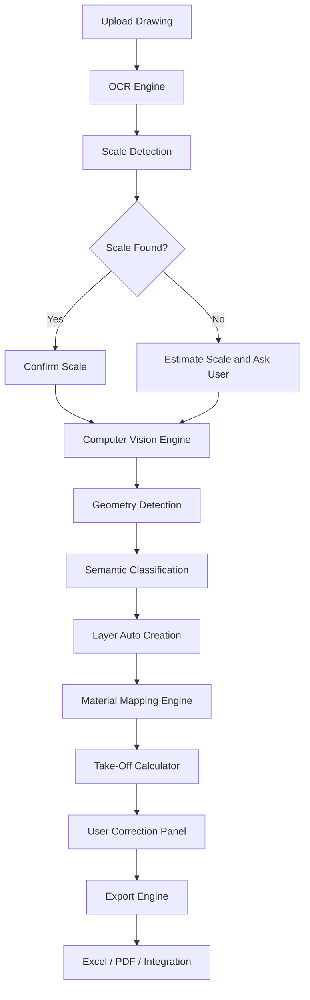
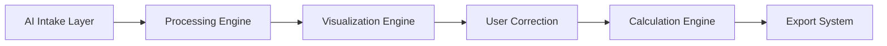
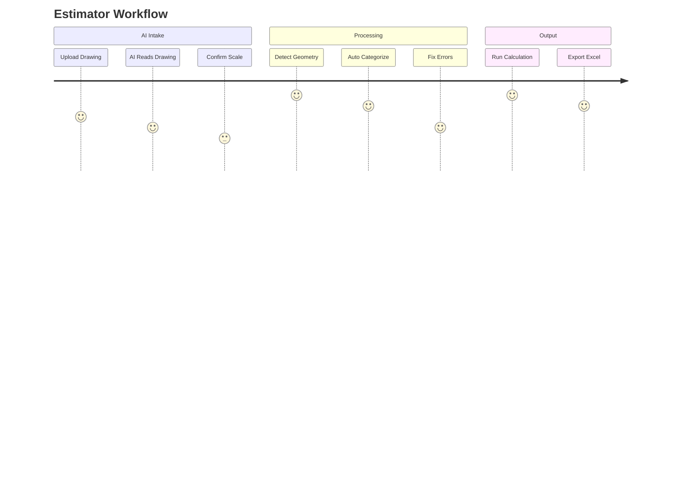

---
aliases:
  - CoNSoL-TakeOff AI Product Story Draft
doc_id: 0601-draft
status: draft
version: 1.3.0-draft
owner: product + engineering
audience: product owner + AI coding agents + solo developer
source_doc:
  - "0601_CoNSoL-TakeOff AI - PRODUCT STORY_single_file_V1.2.md"
related_docs:
  - "0000_AGENT_BRIEFING.md"
  - "0001_MASTER_DASHBOARD.md"
  - "05_SDLC_Library/05_Mega-File.md"
  - "05_SDLC_Library/0005_CoNSoL-TakeOff_SDLC_Gap_Analysis.md"
  - "06_VIBE_CODING_GUIDE/0_CoNSoL_Production_Layers.md"
  - "06_VIBE_CODING_GUIDE/1_Task_Backlog.md"
last_updated: 2026-06
---
# 🏛 CoNSoL-TakeOff AI - Product Story Draft

> Draft purpose: promote the standalone 0601 AI product story into the live documentation-library format without overwriting the current manual-MVP execution plan.

---

## 🔁 Status

This document is a draft bridge between:

- The current live SDLC library, which focuses on a manual-first WinForms MVP.
- The 0601 product story, which defines the wider AI-assisted Take-Off vision.

The current backlog remains the executable source of truth until the AI items below are reviewed and added to `1_Task_Backlog.md` with traceable UC, FR, and GAP IDs.

---

## 👩‍🔬 Coverage Assessment

| **Topic from 0601**                    | **Current library coverage**              | **Draft action**                                                |
| -------------------------------------- | ----------------------------------------- | --------------------------------------------------------------- |
| Visual take-off and estimation         | Covered in 0101, UC-001..UC-008, L01..L04 | Keep as MVP foundation                                          |
| Drawing as measurable business objects | Covered strongly                          | Reuse as the core AI output model                               |
| Layers, visibility, locking            | Covered but not fully implemented         | Complete T-006, T-017, T-024, T-025 before AI layer automation  |
| Quantity, cost, and reports            | Covered but not implemented end-to-end    | Complete T-010..T-023 before AI-generated data can be trusted   |
| Upload drawing                         | Not covered as an active UC               | Add proposed UC-AI-001                                          |
| OCR/text extraction                    | Not covered                               | Add proposed UC-AI-002 and FR-AI-001..003                       |
| Scale detection                        | Mentioned in 0601 only                    | Add proposed UC-AI-003 and use manual confirmation              |
| Geometry detection/redraw              | Not covered                               | Add proposed UC-AI-004 after L01/L03 are stable                 |
| Semantic classification                | Not covered                               | Add proposed UC-AI-005 after tags/layers/material mapping exist |
| AI confidence and review               | Not covered                               | Add proposed UC-AI-006 before any AI output is accepted         |
| AI artifact persistence/audit          | Not in ERD                                | Propose ERD additions before coding                             |

Decision: build the current manual MVP first, then add AI intake as a controlled import and review pipeline. The AI engine should generate editable drawing objects, not bypass the existing canvas, layer, tag, calculation, or export engines.

---

## 🌟 Product Vision

> Upload a drawing -> get quantities, cost, and reports in minutes.

CoNSoL-TakeOff AI is an AI-assisted take-off engine that converts 2D design drawings into measurable construction business objects. The system should reduce manual redrawing, detect drawing information, classify objects, organize them into layers, and produce quantities, cost estimates, and exportable reports.

---

## 📝 Product Purpose

- Enable construction professionals to convert 2D design drawings into measurable business objects that produce:
	- Quantities
	- Cost estimates
	- Reports
- The intended experience is:
	- Minimal manual effort
	- User control over every accepted result
	- Auditability of AI-generated outputs
	- Accuracy through review, correction, and traceability

---

## 🎯 Problem

Construction quantity take-off is still heavily manual.

- **Civil engineers, estimators, and contractors often need to:**
	- Spend hours redrawing plans
	- Interpret drawings manually
	- Extract dimensions
	- Identify construction elements
	- Assign materials
	- Recalculate quantities
	- Generate reports manually
- **This creates:**
	- Human error
	- Time loss
	- Cost overruns
	- Inconsistent outputs

---

## 🚀Solution

CoNSoL-TakeOff AI transforms drawings into structured, layered, computable business data.

The AI does not replace the estimator. It accelerates the setup by producing a first draft of the drawing model:

- Extracted text and metadata
- Detected scale
- Detected geometry
- Classified construction objects
- Auto-created layers
- Suggested material mappings
- Confidence scores
- Reviewable corrections
- Calculated quantities and cost summaries

---

## 👥 Target Users

### Primary Users

- Quantity surveyors
- Estimators
- Civil engineers
- Contractors

### Secondary Users

- Project managers
- Cost controllers
- Procurement teams

---

## 🧭 Product Philosophy

- AI assists; the user decides.
- Users remain in control of accepted project data.
- Outputs must be reviewable, editable, and traceable.
- Generated drawing objects must behave exactly like manually drawn objects after acceptance.

---

## ⚙️ Core Product Principle

Every detected drawing element becomes a business object.

- 🧱 **Examples:**
	- Wall
	- Door
	- Window
	- Slab
	- Column
	- Beam
- 📦 *Each object contains:*
	- Layer assignment
	- Geometry
	- Quantity rules
	- Material mapping
	- Cost attributes
	- Relationships to other objects
	- Source/confidence metadata when produced by AI

---

## 🔄 AI-Assisted Workflow

1. User uploads a drawing.
2. System extracts text and metadata.
3. System detects or requests scale.
4. System detects geometry.
5. System classifies construction objects.
6. System redraws the uploaded drawing as editable canvas objects.
7. System categorizes objects into layers with visibility and locking controls.
8. System assigns confidence scores.
9. User reviews and corrects results.
10. System calculates quantities.
11. System generates reports.
12. System exports business data.

Flow summary:

```text
Upload -> Detect -> Classify -> Review -> Calculate -> Export
```



---

## 📊 System Architecture Overview

0601 introduces an AI intake path that should sit in front of the existing manual MVP engine.

```text
AI Intake -> Processing Engine -> Visualization -> User Control -> Calculation -> Export
```



The important architecture rule: AI output must become normal CoNSoL domain data before calculation or export. That keeps the manual and AI workflows on one shared foundation.

---

## 🗺 Real User Journey



---

## 🚫 Existing UC Alignment

| **Existing UC** | **Current purpose**             | **0601 relationship**                               |
| --------------- | ------------------------------- | --------------------------------------------------- |
| UC-001          | Draw a line on the canvas       | AI-generated lines must become the same object type |
| UC-002          | Assign object to a layer        | AI should suggest layers, but user can edit         |
| UC-003          | Attach Smart Tag                | AI can suggest tags/material classes later          |
| UC-004          | Run take-off quantity summary   | AI output depends on this calculator                |
| UC-005          | Insert symbol from library      | AI may classify symbols or map detected blocks      |
| UC-006          | Edit multi-selection properties | Critical for bulk correction of AI output           |
| UC-007          | Delete layer with objects       | Needed for cleanup of generated layers              |
| UC-008          | Switch deployment mode          | AI mode must respect standalone v1 limits           |
| UC-013          | Save/open project file          | AI artifacts need persistence after ERD approval    |
| UC-014          | Export take-off to file         | Final business value of AI intake                   |

---

## ⚒ Proposed New AI Use Cases

These are draft candidates. They are not active backlog items yet.

| **UC ID** | **Title**                         | **Purpose**                                                              | **Depends on**                                 |
| --------- | --------------------------------- | ------------------------------------------------------------------------ | ---------------------------------------------- |
| UC-AI-001 | Upload drawing for AI intake      | Import PDF/image/CAD-derived raster into project workspace               | UC-013, L03 persistence                        |
| UC-AI-002 | Extract text and metadata         | Run OCR and extract drawing labels, dimensions, title block hints        | UC-AI-001                                      |
| UC-AI-003 | Detect and confirm scale          | Suggest scale, then require user confirmation before geometry conversion | T-001, T-008                                   |
| UC-AI-004 | Detect geometry and redraw        | Convert detected lines/rectangles/polylines into editable canvas objects | L01 HitTest/coordinate stability, L03 entities |
| UC-AI-005 | Classify construction objects     | Suggest Wall/Door/Window/Slab/Column/Beam and auto-create layers         | UC-002, UC-003, UC-AI-004                      |
| UC-AI-006 | Review and correct AI results     | Show confidence, allow accept/reject/edit/bulk correction                | UC-006, L04 panels                             |
| UC-AI-007 | Map materials and cost attributes | Suggest materials/formulas based on classification and tags              | UC-003, UC-004                                 |
| UC-AI-008 | Export reviewed AI take-off       | Produce reports only from accepted/reviewed data                         | UC-004, UC-014                                 |

---

## 🏗 Proposed Functional Requirements

| **FR ID** | **Requirement**                                                                              | **Notes**                                                |
| --------- | -------------------------------------------------------------------------------------------- | -------------------------------------------------------- |
| FR-AI-001 | The system shall allow the user to upload a supported drawing file for AI intake             | File support should start narrow: image/PDF raster first |
| FR-AI-002 | The system shall store the uploaded source artifact separately from accepted drawing objects | Requires ERD review                                      |
| FR-AI-003 | The system shall extract text and metadata from the uploaded drawing                         | OCR output must be reviewable                            |
| FR-AI-004 | The system shall detect or request drawing scale before converting geometry to logical units | User confirmation required                               |
| FR-AI-005 | The system shall detect candidate geometry from the uploaded drawing                         | Candidates are not trusted until accepted                |
| FR-AI-006 | The system shall convert accepted candidate geometry into normal canvas objects              | Must reuse L01/L03 object model                          |
| FR-AI-007 | The system shall classify candidate objects by construction type                             | Classification must include confidence                   |
| FR-AI-008 | The system shall auto-create or suggest layers from classification results                   | Must not delete or overwrite user layers                 |
| FR-AI-009 | The system shall display confidence and source trace for each AI-suggested object            | Needed for auditability                                  |
| FR-AI-010 | The system shall let users accept, reject, or edit AI-suggested objects before calculation   | Human-in-the-loop gate                                   |
| FR-AI-011 | The system shall calculate quantities only from accepted objects                             | Avoids accidental reporting from unreviewed data         |
| FR-AI-012 | The system shall preserve AI audit metadata after save/open                                  | Depends on ERD/file schema decision                      |
| FR-AI-013 | The system shall export reviewed quantities and cost summaries to business-ready formats     | Reuses UC-014                                            |

---

## 👣 Draft User Stories

These user stories are a lightweight bridge from the story language into traceable UC/FR work.

| **US ID** | **Story** | **Maps to** |
| --- | --- | --- |
| US-AI-001 | As a user, I want to upload a drawing so the system can begin AI intake | UC-AI-001, FR-AI-001, FR-AI-002 |
| US-AI-002 | As a user, I want the system to extract text and metadata so I can review it | UC-AI-002, FR-AI-003 |
| US-AI-003 | As a user, I want the scale to be detected or requested so geometry can be interpreted correctly | UC-AI-003, FR-AI-004 |
| US-AI-004 | As a user, I want candidate geometry detected and redrawn as editable objects | UC-AI-004, FR-AI-005, FR-AI-006 |
| US-AI-005 | As a user, I want construction objects classified and layered so the drawing is organized | UC-AI-005, FR-AI-007, FR-AI-008 |
| US-AI-006 | As a user, I want confidence shown so I can decide what to trust | UC-AI-006, FR-AI-009, FR-AI-010 |
| US-AI-007 | As a user, I want to review and correct AI output before calculation | UC-AI-006, FR-AI-010 |
| US-AI-008 | As a user, I want quantities calculated only from accepted objects | UC-AI-007, FR-AI-011 |
| US-AI-009 | As a user, I want AI audit metadata preserved after save/open | UC-AI-001..UC-AI-006, FR-AI-012 |
| US-AI-010 | As a user, I want reviewed results exported as business data | UC-AI-008, FR-AI-013 |
| US-AI-011 | As a user, I want the clean shell to support the AI review workflow | L04, FR-UI-024..FR-UI-036 |
| US-AI-012 | As a user, I want the same business object model to serve manual and AI work | UC-001..UC-014, L01..L03 |

---

## 🧱 Draft AI NFRs

| **NFR ID** | **Requirement** | **Target** |
| --- | --- | --- |
| NFR-AI-001 | AI intake shall remain reviewable and editable before any export or quantity calculation | Human-in-the-loop |
| NFR-AI-002 | AI-derived results shall preserve source trace and confidence metadata | Auditability |
| NFR-AI-003 | AI intake should complete the first-pass extraction within a reasonable desktop workflow time | Performance |
| NFR-AI-004 | AI import shall support offline-first standalone operation for the MVP | Deployment |
| NFR-AI-005 | Accepted AI objects shall behave exactly like manually drawn objects after acceptance | Consistency |
| NFR-AI-006 | AI failures shall degrade gracefully without destroying manual drawing state | Reliability |

---

## 🔗 Traceability Alignment Matrix

| **Live Doc** | **Alignment Check** | **Status** |
| --- | --- | --- |
| `05_Mega-File.md` SRS | Existing UC-001..UC-014, FR-UI-024..FR-UI-036, and the new AI FRs/NFRs can coexist without changing the manual MVP spine | Aligned |
| `05_Mega-File.md` Design | AI workflow depends on L01 canvas stability, L03 persistence, L04 review UI, and L05 service contracts | Aligned |
| `0_CoNSoL_Production_Layers.md` | AI intake overlay now maps cleanly to L03/L04/L05/L06/L07/L08, and the WPF shell additions fit L04 | Aligned |
| `0001_MASTER_DASHBOARD.md` | Dashboard AI roadmap entries already reflect the AI intake progression and can absorb the new user-story bridge | Aligned |
| `1_Task_Backlog.md` | Existing AI tasks T-067..T-075 cover the first wave; the next phase is the clean shell + review workflow + settings work | Mostly aligned |

---

## 🧧 Production Layer Impact

| **Layer**                        | **Impact from 0601**                                                                           | **Build rule**                                      |
| -------------------------------- | ---------------------------------------------------------------------------------------------- | --------------------------------------------------- |
| L01 Canvas & Drawing Engine      | Render AI-generated geometry as normal editable objects; show source/confidence overlays later | Complete coordinate conversion and HitTest first    |
| L02 Business Logic & Calculation | Material mapping, classification-to-formula mapping, quantity/cost rollup                      | Calculator must work before AI outputs are valuable |
| L03 Data Model & Persistence     | Uploaded artifacts, OCR results, AI candidates, confidence/audit metadata                      | No new entities before ERD update                   |
| L04 UI/UX & Presentation         | Upload flow, scale confirmation, AI review/correction panel                                    | Build after layer/property panels are stable        |
| L05 Architecture & Code Quality  | New service contracts for intake/OCR/scale/vision/classification/review                        | Use interfaces and DI; keep AI outside Domain core  |
| L06 Testing & Verification       | Fixtures for drawings, OCR cases, scale-detection cases, geometry acceptance                   | Add tests before calling AI workflow Done           |
| L07 Build, Package & Deployment  | Package any OCR/CV runtime dependencies                                                        | Standalone install must remain simple               |
| L08 Observability & Logging      | Log intake steps, confidence, user decisions, failures, and timings                            | Do not log sensitive drawing content                |

---

## 🤖 Proposed AI Service Contracts

These names are draft candidates for L05/API planning.

| **Interface**                  | **Responsibility**                                                     |
| ------------------------------ | ---------------------------------------------------------------------- |
| `IDrawingImportService`        | Accept source file, validate type/size, create import session          |
| `IOcrService`                  | Extract text and metadata from uploaded source                         |
| `IScaleDetectionService`       | Suggest scale and confidence, request user confirmation when uncertain |
| `IGeometryDetectionService`    | Produce candidate geometry from source artifact                        |
| `IObjectClassificationService` | Classify geometry candidates as construction object types              |
| `IAiReviewService`             | Manage accept/reject/edit state for AI candidates                      |
| `IMaterialSuggestionService`   | Suggest material/formula mappings from classification and tags         |

Implementation rule: these services produce candidates. Only reviewed candidates become durable drawing objects.

---

## 📅 Proposed Data Additions

Do not implement these until `0005_CoNSoL-TakeOff_SDLC_Gap_Analysis.md` and `020103 Data Model` are updated.

| **Candidate entity**    | **Purpose**                                            |
| ----------------------- | ------------------------------------------------------ |
| `IMPORT_SESSION`        | One AI intake run for one source drawing               |
| `SOURCE_ARTIFACT`       | Uploaded file metadata and storage reference           |
| `OCR_RESULT`            | Extracted text, bounding boxes, confidence             |
| `AI_GEOMETRY_CANDIDATE` | Detected candidate shape before user acceptance        |
| `AI_CLASSIFICATION`     | Candidate semantic class, confidence, rationale/source |
| `AI_REVIEW_DECISION`    | User accept/reject/edit decision with timestamp        |

Persistence rule: accepted candidates should reference normal `DRAWING_OBJECT` records, not duplicate final geometry in a separate AI-only model.

---

## 🛠 Execution Roadmap

### 🧪 Phase 1 - AI Intake Foundation

- Upload drawing
- Validate source file
- Store source artifact
- Run OCR/text extraction
- Show extracted metadata

### ⚙️ Phase 2 - Scale and Geometry

- Detect scale
- Ask user to confirm scale
- Detect candidate geometry
- Convert geometry using `CoordinateConverter`
- Preview candidates over the source drawing

### 🧠 Phase 3 - Smart Layers and Classification

- Classify detected objects
- Auto-suggest layers
- Suggest material mappings
- Preserve confidence and source trace

### 📤 Phase 4 - User Correction and Export

- Accept/reject/edit candidate objects
- Convert accepted candidates to normal canvas objects
- Run take-off calculation
- Export reports

---

## ⛳ Recommended Development Continuation Plan

The safest plan is to keep building in the order already implied by `0_CoNSoL_Production_Layers.md` and `1_Task_Backlog.md`, then promote 0601 into the live SDLC once the manual foundation is usable.

### Wave 0 - Documentation Alignment

Goal: make 0601 visible in the live library without disrupting current MVP work.

- Keep this draft as the product-story bridge.
- Add formal AI use cases to SRS only after review.
- Add AI gaps to the gap analysis only after the ERD/service-boundary decisions are approved.
- Add AI tasks to `1_Task_Backlog.md` only with UC/FR/GAP traceability.

### Wave 1 - Manual MVP Foundation

Goal: make user-created geometry trustworthy.

Primary tasks:

- T-001 Coordinate conversion
- T-002..T-005 HitTest and selection logic
- T-006 Layer entity
- T-008 CanvasLayoutValidator
- T-010..T-013 Calculator D0/D1/D2/D3
- T-014..T-016 Command/Undo foundation

Reason: AI-generated geometry cannot be reviewed or calculated safely until coordinate conversion, layers, validation, calculator logic, and undo exist.

### Wave 2 - MVP Product Flow

Goal: complete the end-to-end path from drawing to take-off output.

Primary tasks:

- T-017..T-020 service interfaces
- T-021..T-023 take-off summary, cost aggregation, export
- T-024..T-031 layer panel and property panel wiring
- T-032..T-034 first test strategy and test projects
- T-047..T-049 acceptance tests for core use cases

Outcome: the app can support the existing MVP promise: draw, layer, define, calculate, export.

### Wave 3 - AI Intake SDLC Promotion

Goal: turn 0601 from product story into executable SDLC work.

Deliverables:

- Add UC-AI-001..UC-AI-008 to the SRS/use-case section.
- Add FR-AI-001..FR-AI-013 to requirements.
- Add proposed AI data additions to the ERD for review.
- Add service contracts for import, OCR, scale detection, geometry detection, classification, and review.
- Add test fixtures for source drawings and expected candidate outputs.

### Wave 4 - AI Intake MVP

Goal: import a drawing and produce reviewed, editable canvas objects.

First implementation scope:

- Upload image/PDF raster.
- Extract OCR text.
- Detect or manually confirm scale.
- Detect simple line/rectangle geometry.
- Preview candidates.
- Let the user accept/reject/edit candidates.
- Convert accepted candidates into normal `DRAWING_OBJECT` records.

Out of first AI scope:

- Fully autonomous estimation.
- YOLO/custom model training.
- Cloud inference.
- Unreviewed export.
- True 3D detection.

### Wave 5 - AI Classification and Business Output

Goal: connect AI-detected geometry to business meaning.

Primary capabilities:

- Classify candidate objects as wall, door, window, slab, column, or beam.
- Suggest layers automatically.
- Suggest material/formula mappings.
- Run existing take-off calculation on accepted objects.
- Export accepted/reviewed quantities and costs.

---

## 💡 Core Value Proposition

| **Feature**          | **Benefit**                        |
| -------------------- | ---------------------------------- |
| AI reading drawings  | Save preparation time              |
| Auto scale detection | Improve measurement accuracy       |
| Layer separation     | Make generated drawings reviewable |
| Material mapping     | Produce faster cost insight        |
| Export reports       | Deliver business-ready output      |

---

## ✅ Success Metrics

- Reduced take-off preparation time
- Fewer measurement errors
- Less repetitive manual redrawing
- Faster report generation
- Higher consistency across projects
- User acceptance rate of AI-generated candidates
- Percentage of AI objects requiring correction
- Time from upload to reviewed take-off report

---

## 🔥 Key Differentiators

- No manual drawing required for first-pass setup
- AI-assisted drawing interpretation
- User-controlled correction and acceptance
- Built for real construction take-off workflows
- Uses the same business-object model for manual and AI-generated data

---

## 💼Business Impact

- Reduce estimation time from hours to minutes for supported drawing types.
- Improve consistency across projects.
- Make estimation workflows more scalable.
- Prepare a path for future integration with project management systems.

---

## 📊 Draft Execution Matrix

These are draft 0601 planning items. They should not replace `1_Task_Backlog.md` until approved and traced.

| **ID**  | **Category** | **Task**              | **Status**        | **Depends on**          | **Notes**                                       |
| ------- | ------------ | --------------------- | ----------------- | ----------------------- | ----------------------------------------------- |
| AI-001  | AI           | OCR text extraction   | PROPOSED          | UC-AI-001               | Candidate provider: Tesseract or equivalent     |
| AI-002  | AI           | Scale detection       | PROPOSED          | AI-001, T-001           | Pattern-based first; user confirmation required |
| AI-003  | AI           | Geometry detection    | PROPOSED          | AI-002, T-002..T-005    | OpenCV-style pipeline; simple geometry first    |
| AI-004  | AI           | Classification engine | PROPOSED          | AI-003, UC-002, UC-003  | Rule-based first, ML later                      |
| AI-005  | AI           | YOLO integration      | FUTURE            | AI-003, labeled dataset | Future upgrade, not MVP                         |
| UI-001  | UI           | Canvas rendering      | ACTIVE FOUNDATION | L01 tasks               | Existing system; improve reliability            |
| UI-002  | UI           | Layer panel           | ACTIVE BACKLOG    | T-024                   | Needed before layer auto-creation               |
| UI-003  | UI           | Properties panel      | ACTIVE BACKLOG    | T-026..T-031            | Needed for correction workflow                  |
| UI-004  | UI           | Selection UX          | ACTIVE BACKLOG    | T-002..T-005            | Needed for review/edit                          |
| BUS-001 | Business     | Take-off calculator   | ACTIVE BACKLOG    | T-010..T-013            | Must be completed before AI report value        |
| BUS-002 | Business     | Material mapping      | PROPOSED          | UC-003, UC-004          | Expand after calculator is stable               |
| EXP-001 | Export       | Excel/CSV export      | ACTIVE BACKLOG    | T-023                   | CSV first per current backlog                   |
| EXP-002 | Export       | PDF export            | FUTURE            | EXP-001                 | Add after MVP export                            |
| SYS-001 | System       | Logging               | ACTIVE BACKLOG    | T-053..T-055            | Extend for AI intake later                      |
| SYS-002 | System       | Config/default scale  | ACTIVE BACKLOG    | T-008, T-015 area       | Needed for scale defaults                       |
| SYS-003 | System       | Caching               | FUTURE            | AI-001                  | Only after intake performance demands it        |

---

## 📝 Open Decisions

| **Decision**           | **Why it matters**                        | **Recommended next step**                            |
| ---------------------- | ----------------------------------------- | ---------------------------------------------------- |
| AI source file support | Controls scope and dependencies           | Start with image/PDF raster only                     |
| OCR/CV provider        | Affects packaging and licensing           | Evaluate local/offline-first providers               |
| ERD additions          | Needed before persistence work            | Draft ERD extension and review before coding         |
| Confidence model       | Needed for user trust                     | Store confidence per candidate and classification    |
| Review gate            | Prevents unreviewed AI output in reports  | Require accept/reject/edit before calculation/export |
| Packaging impact       | OCR/CV libraries may complicate installer | Resolve after L07 standalone packaging decision      |

---

## ✍ Acceptance Gate for 0601 Promotion

This draft can be promoted into the live SDLC library when:

- AI use cases are added with normal UC format.
- AI FRs are added to the requirements and RTM.
- AI data additions are approved in the ERD.
- AI service contracts are defined in L05/API docs.
- AI tasks are added to `1_Task_Backlog.md` with traceable IDs.


## ⏳ Remaining To Promote

These are the draft items that still need promotion into the live SDLC library or backlog.

| **Category** | **Item**                                                    | **Status**       | **Where It Belongs**                                         |
| ------------ | ----------------------------------------------------------- | ---------------- | ------------------------------------------------------------ |
| Data         | Import session and source artifact persistence              | Not yet promoted | `0_CoNSoL_Production_Layers.md`, `1_Task_Backlog.md`         |
| AI           | OCR result storage and reviewable metadata                  | Not yet promoted | `0_CoNSoL_Production_Layers.md`, `1_Task_Backlog.md`         |
| AI           | Geometry candidate detection and preview                    | Not yet promoted | `0_CoNSoL_Production_Layers.md`, `1_Task_Backlog.md`         |
| AI           | Scale detection and user confirmation                       | Not yet promoted | `0_CoNSoL_Production_Layers.md`, `1_Task_Backlog.md`         |
| AI           | Classification confidence, source trace, accept/reject/edit | Not yet promoted | `0_CoNSoL_Production_Layers.md`, `1_Task_Backlog.md`         |
| UI           | AI review surface in the clean form                         | Not yet promoted | `0_CoNSoL_Production_Layers.md`, `1_Task_Backlog.md`         |
| Testing      | AI intake fixtures and acceptance coverage                  | Not yet promoted | `1_Task_Backlog.md`, `0401_Testing_Documentation.md`         |
| Ops          | AI logging, tracing, and package fallback                   | Not yet promoted | `0_CoNSoL_Production_Layers.md`, `1_Task_Backlog.md`, `0304` |
