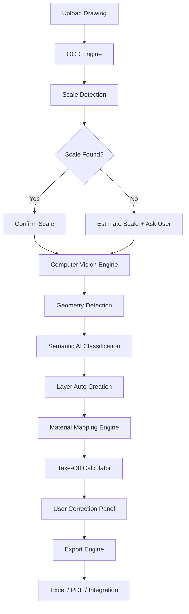
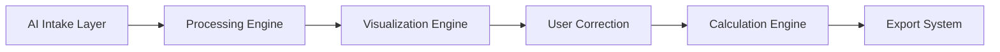
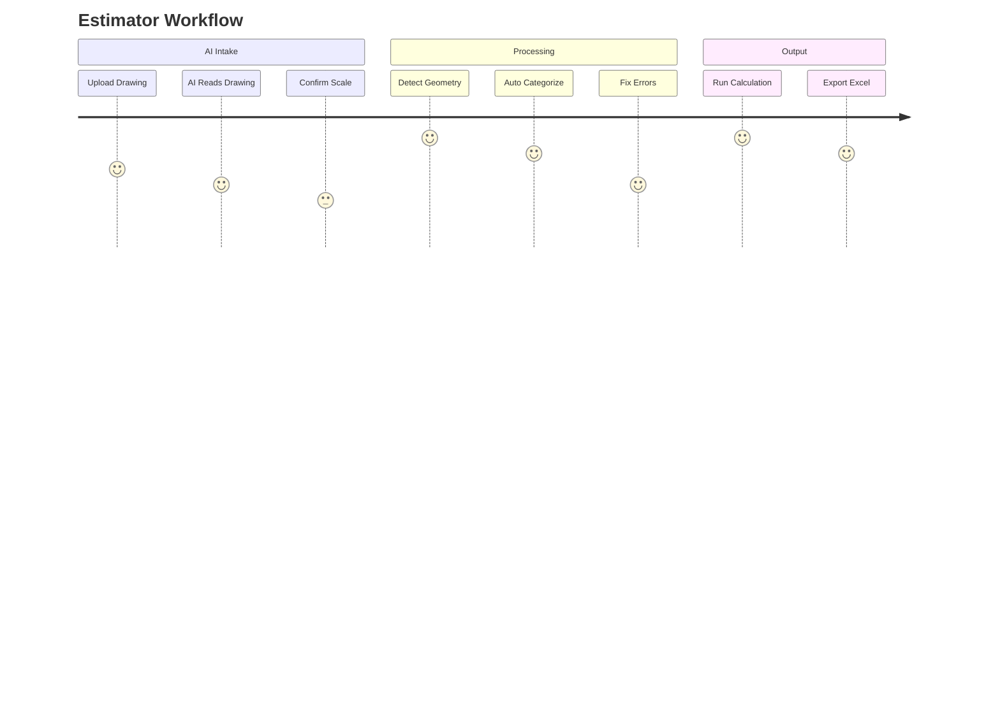

> HTML Page: [[HTML Pages/0601_CoNSoL-TakeOff AI - PRODUCT STORY_single_file_V1.2.html|Open HTML Page]]

# 🏛 CoNSoL-TakeOff AI — PRODUCT STORY
# 🤖 AI Product Vision

---

## 🌟 Product Vision

> “Upload a drawing → Get quantities, cost, and reports in minutes.”

---

## 📝 Product Purpose (Mission & Goal)

Enable construction professionals to convert 2D design drawings into **measurable business objects** that produce quantities, cost estimates, and reports with minimal manual effort, using AI agent to redraw the uploaded drawing and categorize them into layers, giving visibility, locking controls. 

***This is to produce:***
- Quantities  
- Cost estimates  
- Reports  

✅ With minimal manual effort  
✅ While maintaining **user control, auditability, and accuracy**

---

## 🎯 The Problem

Construction quantity take-off is still heavily manual.

Civil engineers, estimators, and contractors must:

- Spend **hours redrawing plans**
- Interpret drawings manually
- Extract dimensions
- Identify elements
- Assign materials
- Recalculate quantities
- Generate reports manually

👉 This leads to:

❌ Human error  
❌ Time loss  
❌ Cost overruns  
❌ Inconsistent outputs  

---

## 🚀 The Solution

# 🏛 AI-Powered Take-Off Engine

An intelligent system that transforms drawings into structured, Layered, computable business data using AI.

---

## 👥 Target Users

### 🎯 Primary Users

- Quantity Surveyors  
- Estimators  
- Civil Engineers  
- Contractors  

### 📊 Secondary Users

- Project Managers  
- Cost Controllers  
- Procurement Teams  

---

## 🧭 Product Philosophy

- 🤖 AI assists, not replaces  
- 👤 Users remain in control  
- 🔍 All outputs are reviewable, editable, and traceable  

---

## ⚙️ Core Product Principle

Every detected drawing element becomes a **business object**.

### 🧱 Examples

- Wall  
- Door  
- Window  
- Slab  
- Column  
- Beam  

### 📦 Each Object Contains

- Layers
- Geometry  
- Quantity Rules  
- Material Mapping  
- Cost Attributes  
- Relationships  

---

## 🧠 System Intelligence Flow

### 🔄 AI-Assisted Workflow

1. User uploads drawing  
2. System extracts text and metadata  
3. System detects scale  
4. System detects geometry  
5. System classifies construction objects 
6. System redraw the uploaded drawing and categorize them as layers, giving visibility, locking controls.
7. System assigns confidence scores  
8. User reviews and corrects results  
9. System calculates quantities  
10. System generates reports  
11. System exports business data  

---

### 📊 Flow Summary

Upload → Detect → Classify → Calculate → Export  

---

## 🧱 System Architecture Overview

### 🧩 Layers

- AI Intake
- Processing Engine
- Visualization
- User Control
- Export System

---

## 🗺 Real User Journey

---

## 🛠 Execution Roadmap

### 🧪 Phase 1

- AI Intake
- Scale Detection

### ⚙️ Phase 2

- Geometry Detection
- Classification

### 🧠 Phase 3

- Smart Layers
- Material Mapping
- Cost Management

### 📤 Phase 4

- Export
- User Corrections

---

## 💡 Core Value Proposition

|Feature|Benefit|
|---|---|
|AI reading drawings|⏱ Save up to 80% time|
|Auto scale detection|🎯 Improved accuracy|
|Layer separation|👁️ Clear visualization|
|Material mapping|💰 Instant cost insights|
|Export reports|📊 Business-ready output|

---

## ✅ Success Metrics

- Reduced take-off preparation time
- Fewer measurement errors
- Less repetitive manual work
- Faster report generation
- Higher consistency across projects

---

## 🔥 Key Differentiators

✅ No manual drawing required  
✅ AI-assisted interpretation  
✅ User-controlled correction  
✅ Built for real construction workflows

---

## 💼 Business Impact

- Reduce estimation time from **hours → minutes**
- Improve accuracy across projects
- Enable scalable estimation workflows
- Integrate with project management systems

---

## 🏛 CoNSoL-TakeOff AI Execution Matrix - Task Tracker
### 📊 Overview

| ID      | Category | Task                  | Status | Depends On | Notes             |
| ------- | -------- | --------------------- | ------ | ---------- | ----------------- |
| AI-001  | AI       | OCR Text Extraction   | 🔲     | —          | Tesseract         |
| AI-002  | AI       | Scale Detection       | 🔲     | AI-001     | Pattern-based     |
| AI-003  | AI       | Geometry Detection    | 🔲     | AI-002     | OpenCV            |
| AI-004  | AI       | Classification Engine | 🔲     | AI-003     | Rule-based        |
| AI-005  | AI       | YOLO Integration      | 🔲     | AI-003     | Future upgrade    |
| UI-001  | UI       | Canvas Rendering      | 🔲     | —          | Stable            |
| UI-002  | UI       | Layer Panel           | 🔲     | AI-004     | Needs binding     |
| UI-003  | UI       | Properties Panel      | 🔲     | UI-001     | Works             |
| UI-004  | UI       | Selection UX          | 🔲     | UI-001     | Improve lines     |
| BUS-001 | Business | TakeOff Calculator    | 🔲     | —          | Working           |
| BUS-002 | Business | Material Mapping      | 🔲     | AI-004     | Expand logic      |
| EXP-001 | Export   | Excel Export          | 🔲     | BUS-001    | Done              |
| EXP-002 | Export   | PDF Export            | 🔲     | EXP-001    | Pending           |
| SYS-001 | System   | Logging               | 🔲     | —          | Stable            |
| SYS-002 | System   | Config                | 🔲     | —          | Add default scale |
| SYS-003 | System   | Caching               | 🔲     | AI-001     | Must add          |

---

