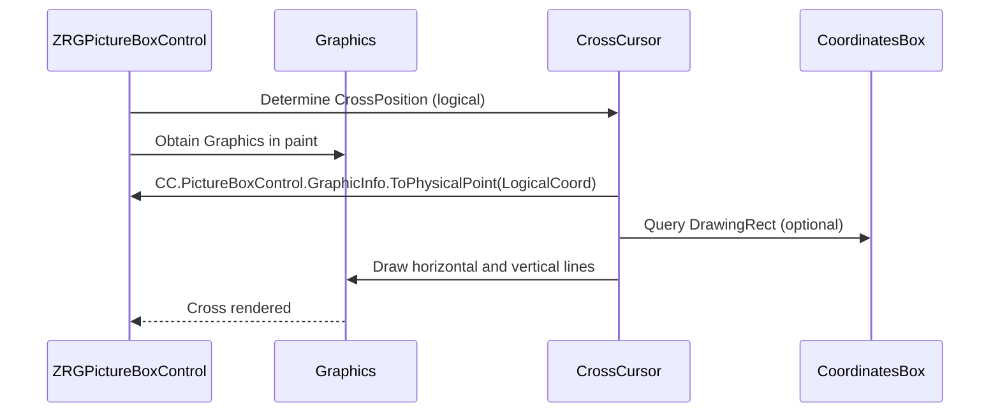

# CrossCursor — Documentation

This document describes `CrossCursor` (file: `Cursors\CrossCursor.vb`) — the helper class inside `ZRGPictureBoxControl` that renders a crosshair cursor overlay on the picture-box surface.

---

## 1. Purpose

`CrossCursor` draws a crosshair centered at a logical coordinate. It supports both a compact cross (local arms of configurable size) and a full-picture-box cross (full-width/height lines) used for precise measurement and edit modes. It coordinates with `CoordinatesBox` to avoid drawing over the coordinate overlay.

## 2. Key fields and properties

- `myPictureBox As ZRGPictureBoxControl` — parent control reference.
- `mySize As Size` — cross size when not full-screen; default `DefaultSize = 20x20`.
- `myFullPictureBoxCross As Boolean` — when true, draw full-width and full-height crosshair lines across the control.
- `myColor As Color` — pen color used to draw crosshair lines.
- `myCrossPosition As Point` — the logical coordinate where the crosshair is drawn (`RECT.InvalidPoint` when unset).
- `myLastCross*Point` — cached physical end points for the last drawn cross (top/left/right/bottom) to allow optimized redraws or hit checks.
- `myCoordinatesBox As CoordinatesBox` — optional reference to avoid drawing the cross over the coordinate overlay.

Properties:

- `PictureBoxControl` (read-only) — parent control.
- `Size` — get/set cross size.
- `Color` — get/set cross color.
- `CoordinatesBox` — link to the coordinates overlay so `CrossCursor` does not draw on it.
- `CrossPosition` — logical coordinate for cross drawing; `ResetCrossPosition()` clears it.

## 3. Drawing logic

`DrawCross(GR As Graphics, LogicalCoord As Point)` performs the following steps:

1. Validate parent and logical coordinate.
2. Convert logical coordinate to physical coordinate using `PictureBoxControl.GraphicInfo.ToPhysicalPoint(LogicalCoord)`.
3. Determine drawing bounds (min = 0,0; max = control width/height) and adjust to avoid `CoordinatesBox.DrawingRect` if present:
	- If not full-screen and the cross center lies inside the coordinates box, do not draw.
	- Otherwise shrink maximum extents to leave space for the coordinates box so lines do not overlap it.
4. Compute physical end points depending on `myFullPictureBoxCross`:
	- Full-screen: left = 0, right = control width; top = 0, bottom = control height; both lines cross at physicalCrossCoords.
	- Compact: arms extend half `mySize` from the center.
5. Clamp end points to control bounds.
6. Draw two lines (horizontal and vertical) using a `Pen(myColor)`.

The method carefully clamps coordinates to avoid drawing outside the control area (prevents drawing onto other controls) and respects the coordinates overlay.

## 4. Interaction with other components

- `CoordinatesBox.DrawingRect` is inspected to avoid overlay collisions; `CrossCursor` shortens arms or skips drawing when the cross would overlap the coordinates box.
- `CrossCursor` uses `PictureBoxControl.GraphicInfo` so it renders consistently at all zoom levels.
- `CrossCursor` is typically invoked from the parent's paint routine after underlying layers (background, grid, selection) are drawn, and before mouse overlays are presented.

Mermaid sequence: how cross cursor gets drawn during paint

## 5. Usage and lifecycle

- Construct with `New(picPictureBox As ZRGPictureBoxControl)` and the parent stores the instance.
- Set `CrossPosition` when the mouse moves or measurement mode is active; call `PictureBox.Invalidate()` for the region impacted to refresh the cross.
- Use `ResetCrossPosition()` to hide the cross.

## 6. Edge-cases and recommendations

- The code uses integer coordinates; on high DPI or sub-pixel rendering, consider using `PointF` and `Graphics.DrawLine` overloads accepting `Single` for smoother rendering.
- The `CoordinatesBox` exclusion logic is basic and assumes the overlay is anchored at bottom-right; if layout changes, update logic accordingly.
- Current code uses `MsgBox` for exception reporting; for library or headless usage replace with logging or exceptions.

---
