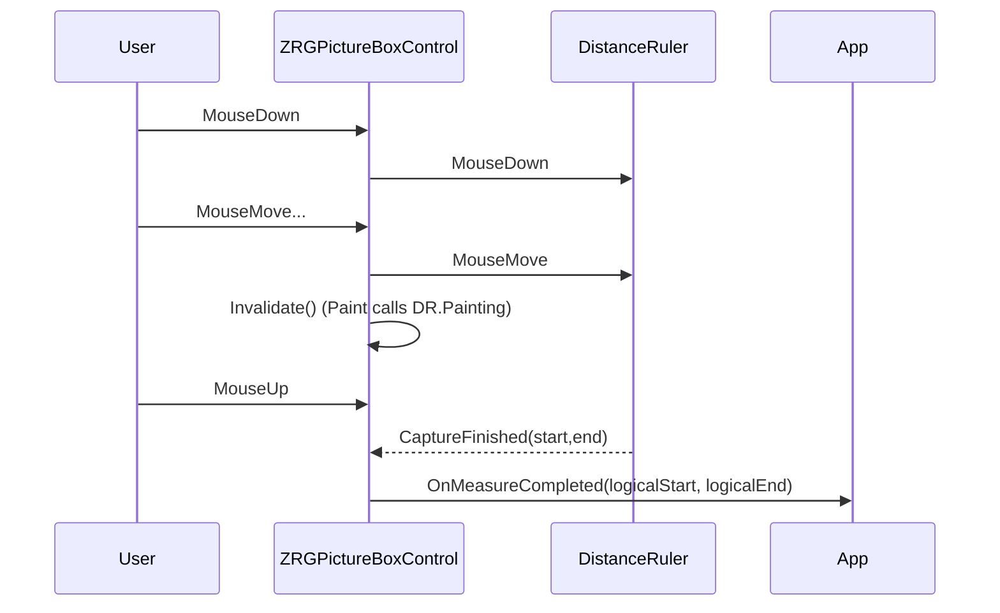
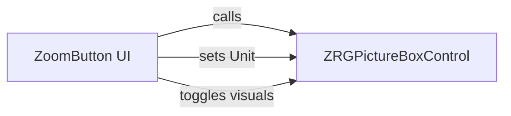
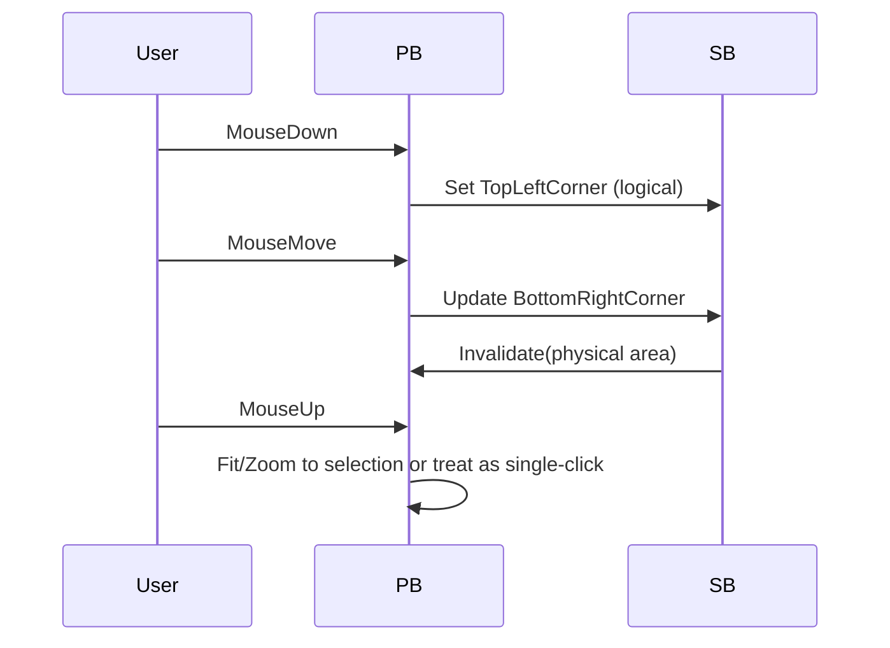
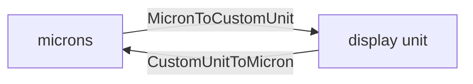

## 01- ZRGPictureBoxControl

Reference and short usage examples.

- Public API quick example (VB.NET):

```vbnet
' Assume zpb is a ZRGPictureBoxControl instance on the form
' Subscribe to events
AddHandler zpb.MouseClick, Sub(sender, e)
    ' e provides logical coords (see control docs)
End Sub
AddHandler zpb.OnMeasureCompleted, Sub(startPt, endPt)
    ' startPt and endPt are logical points from measurement
End Sub

' Programmatic zoom to a logical rect
Dim r As New RECT(0,0,10000,8000)
zpb.ShowLogicalWindow(r, CenterWindow:=True)

' Zoom forward/back
zpb.ZoomForwardUsingCenter(New Point(zpb.VisibleRect.CenterPoint.X, zpb.VisibleRect.CenterPoint.Y))
zpb.ZoomBackOnLogicalCenter()

' Toggle UI flags
zpb.ShowGrid = True
zpb.ShowRulers = True
zpb.UnitOfMeasure = MeasureSystem.enUniMis.mm
zpb.Redraw()
```

Mermaid: event flow for a measurement



---

## 02-ZoomButton

Mapping of UI elements to `LinkedPictureBox` actions (summary):

- `btViewRulers` -> `LinkedPictureBox.ShowRulers`
- `btViewGrid` -> `LinkedPictureBox.ShowGrid`
- `btViewScrollBars` -> `LinkedPictureBox.ShowScrollbars`
- `btMeasure` -> `LinkedPictureBox.ClickAction = MeasureDistance`
- `btZoom` -> `LinkedPictureBox.ClickAction = Zoom`
- `btZoomFit` -> `LinkedPictureBox.ZoomToFit()`
- `btLoad` -> load image and `LinkedPictureBox.ZoomToDefaultRect()`
- `tbPixelSizeMic` -> `LinkedPictureBox.BackgroundImagePixelSize_Mic`

Example: wire a simple toolstrip button

```vbnet
Private Sub btnZoomFit_Click(sender As Object, e As EventArgs)
    If myZoomButton.LinkedPictureBox IsNot Nothing Then
        myZoomButton.LinkedPictureBox.ZoomToFit()
    End If
End Sub
```

Mermaid: control -> picturebox interactions



---

## 03-SelectionBoxElement

Short snippet showing typical mouse handling integration in the parent control:

```vbnet
Protected Overrides Sub OnMouseDown(e As MouseEventArgs)
    If ClickAction = enClickAction.Zoom Then
        Dim logical As Point = GraphicInfo.ToLogicalPoint(e.Location)
        SelectionBox.TopLeftCorner = logical
    End If
End Sub

Protected Overrides Sub OnMouseMove(e As MouseEventArgs)
    If SelectionBox.TopLeftCorner <> RECT.InvalidPoint Then
        SelectionBox.BottomRightCorner = GraphicInfo.ToLogicalPoint(e.Location)
        SelectionBox.Invalidate()
    End If
End Sub

Protected Overrides Sub OnMouseUp(e As MouseEventArgs)
    If Not SelectionBox.IsInvalid Then
        ' finalize: compute rect and zoom
        Dim sel As RECT = SelectionBox
        If Not sel.IsZeroSized Then
            ShowLogicalWindow(sel, CenterWindow:=False)
        End If
        SelectionBox.Reset()
    End If
End Sub
```

Mermaid: selection flow



---

## 04-CoordinatesBox

Example: call from `OnPaint` to draw current logical mouse location:

```vbnet
Protected Overrides Sub OnPaint(e As PaintEventArgs)
    MyBase.OnPaint(e)
    If ShowMouseCoordinates Then
        Dim logicalMouse As Point = GraphicInfo.ToLogicalPoint(Me.PointToClient(Control.MousePosition))
        CoordinatesBox.DrawCoordinateInfo(e.Graphics, logicalMouse, PixelCoordMode:=False)
    End If
End Sub
```

Notes:
- `CoordinatesBox.DrawingRect` can be used by `CrossCursor` to avoid overlap.

---

## 05-MeasureSystem

Simple conversion examples:

```vbnet
Dim microns As Double = 25400 ' 1 inch in microns
Dim inches As Double = MeasureSystem.MicronToCustomUnit(microns, MeasureSystem.enUniMis.inches)
' inches == 1.0

Dim mm As Double = MeasureSystem.MicronToCustomUnit(2000, MeasureSystem.enUniMis.mm)
' mm == 2

' Convert user input 2 mm to microns
Dim micronsFromMM As Integer = MeasureSystem.CustomUnitToMicron(2, MeasureSystem.enUniMis.mm)
' micronsFromMM == 2000
```

Mermaid: unit conversion flow



---

## 06-Ruler

Usage: `Rulers.Draw(graphics)` is invoked by the parent paint routine; the `Rulers` class caches bitmaps and rebuilds them when view changes.

- Call `Rulers.GetRulerStep()` to read current tick spacing.
- `Rulers.DrawHorizontalDragDropLine(gr, yLogical)` draws a visual helper line for drag operations.

Example: parent paint compose order (simplified)

```vbnet
Using g As Graphics = e.Graphics
    ' Draw cached background
    If myPictureBoxImageGR IsNot Nothing Then myPictureBoxImageGR.Draw(g)
    ' Draw grid
    DrawGrid(g)
    ' Draw rulers on top
    myRulers.Draw(g)
End Using
```

---

## 07-DistanceRuler

Wiring example (attach to parent mouse events and paint):

```vbnet
' In parent initialization
AddHandler myDistanceRuler.CaptureFinished, AddressOf OnDistanceCaptured

Private Sub OnDistanceCaptured(sender As Object, e As CaptureEventArgs)
    Dim startLogical As Point = GraphicInfo.ToLogicalPoint(e.StartPoint)
    Dim endLogical As Point = GraphicInfo.ToLogicalPoint(e.EndPoint)
    RaiseEvent OnMeasureCompleted(startLogical, endLogical)
End Sub

' In OnPaint
If myDistanceRuler IsNot Nothing Then
    myDistanceRuler.Painting(e.Graphics)
End If
```

Sequence diagram included earlier in component docs.

---

## 08-ConversionInfo

Examples converting mouse pixel coords to logical coords and back:

```vbnet
Dim physical As New Point(mouseX, mouseY)
Dim logical As Point = GraphicInfo.ToLogicalPoint(physical)
Dim backPhysical As Point = GraphicInfo.ToPhysicalPoint(logical)
' backPhysical should equal (approximately) original physical coords if scale/origin unchanged
```

Notes: prefer `PointF` support if sub-pixel precision needed.

---

## 09-BackImageGraphics

Example of setting and using the background image from application code:

```vbnet
zpb.Image = Image.FromFile("C:\images\tile.png")
zpb.BackgroundImagePixelSize_Mic = 100 ' micron per pixel
zpb.ImageCustomOrigin = New Point(0,0)
zpb.ShowPictureBoxBackgroundImage = True
zpb.Redraw(True)
```

Mermaid: background draw order shown in `ZRGPictureBoxControl` docs.

---

## 10-CrossCursor

How to update and draw cross cursor on mouse move:

```vbnet
Protected Overrides Sub OnMouseMove(e As MouseEventArgs)
    Dim logical As Point = GraphicInfo.ToLogicalPoint(e.Location)
    FullCrossCursor.CrossPosition = logical
    Invalidate() ' or Invalidate(region around cross)
End Sub

Protected Overrides Sub OnPaint(e As PaintEventArgs)
    MyBase.OnPaint(e)
    FullCrossCursor.DrawCross(e.Graphics)
End Sub
```

---

## 11-cCommonCursors

Suggestion: implement `IDisposable` to deterministically free native icon handles. Current usage exposes shared `EditCursor` and `ZoomCursor` properties which lazy-load resources.

Example IDisposable sketch (not applied):

```vbnet
Public Sub Dispose()
    If myInternalIcon IsNot Nothing Then
        DestroyIcon(myInternalIcon.Handle)
        myInternalIcon = Nothing
    End If
    If myCustomCursor IsNot Nothing Then
        myCustomCursor.Dispose()
        myCustomCursor = Nothing
    End If
End Sub
```

---

## 12-PublicTypes

Quick reference: `RECT` and `SEGMENT` APIs are used for geometry. `RECT.InvalidPoint()` returns sentinel point.

Example: make a `RECT` from points and normalize

```vbnet
Dim r As New RECT(pt1, pt2)
r.NormalizeRect()
If r.IsZeroSized Then Return
```

---

## 13-Extra notes & best practices

- Avoid `MsgBox` in library code; replace with structured logging or rethrow exceptions so calling code can handle them.
- Dispose heavy GDI objects (Bitmaps, Pens, Cursors, Icons) deterministically to avoid handle leaks.
- Prefer `PointF` and floating conversions for high DPI/subpixel accuracy where appropriate.
- Keep paint order stable: Background -> Grid -> Image overlays -> Rulers -> Selection/Measurement overlays -> Cross cursor -> Coordinates box.

If you want, I can generate small focused code snippets or an API table for any one of the numbered items above.  

---


